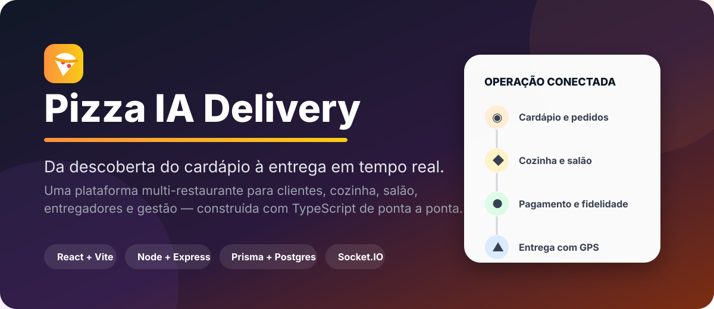
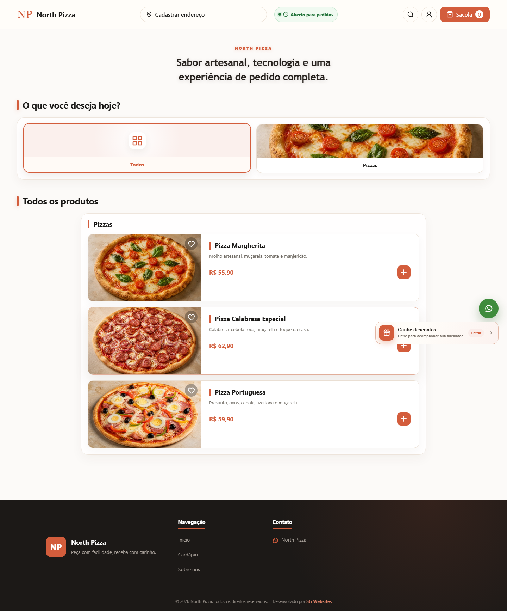
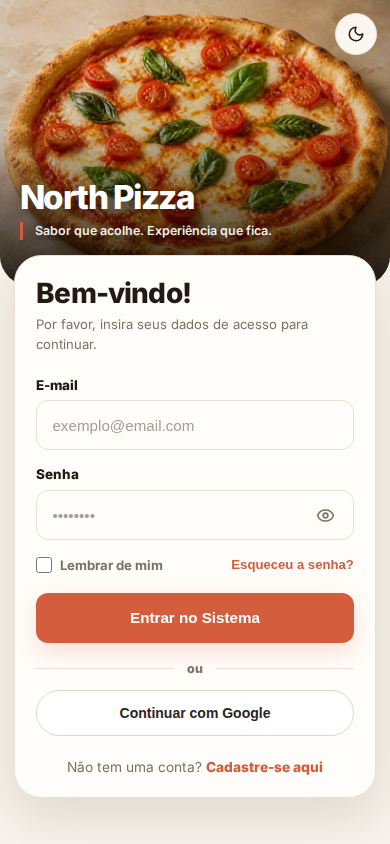
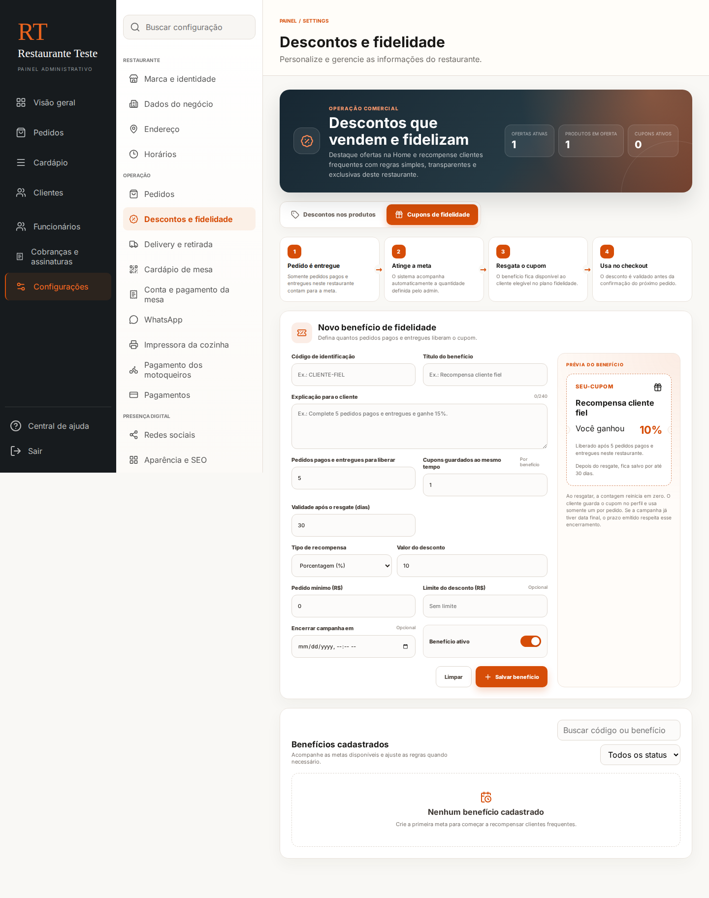
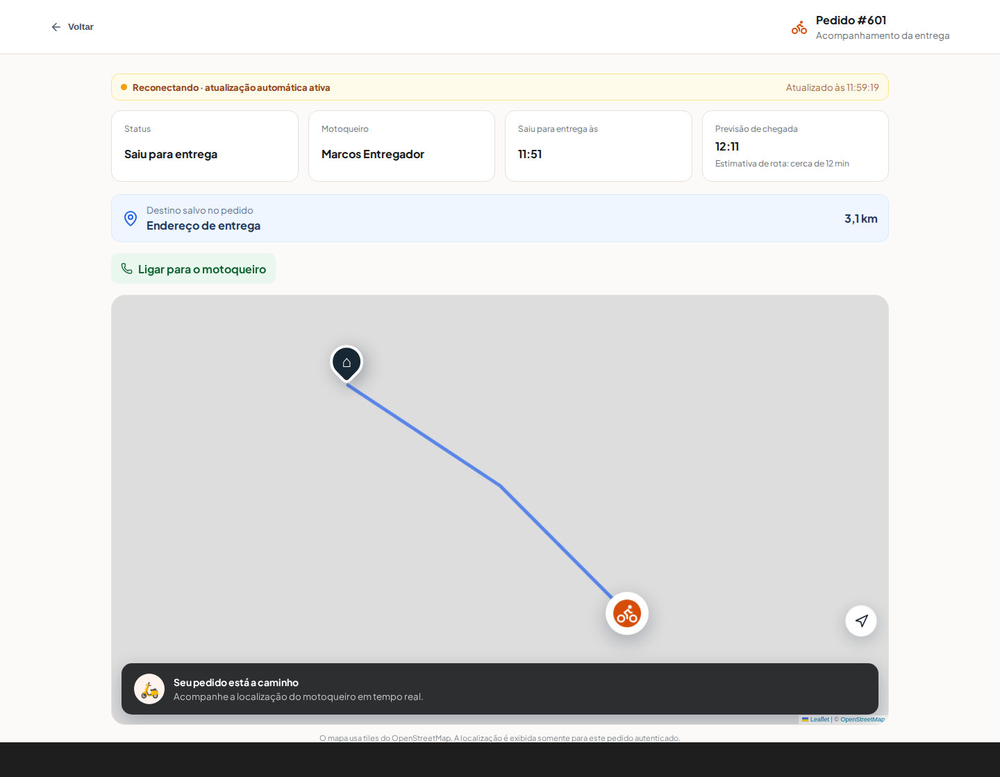
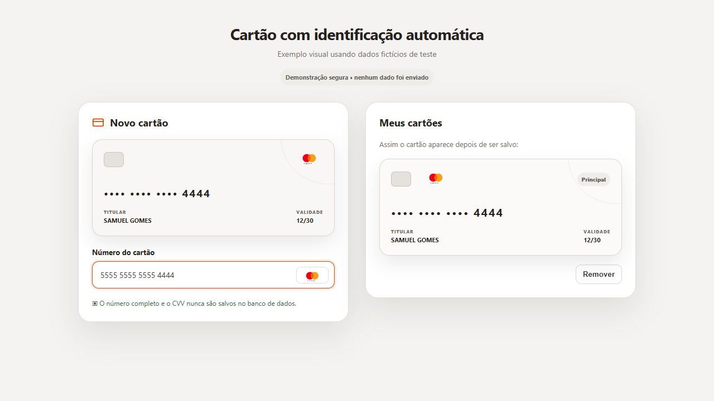
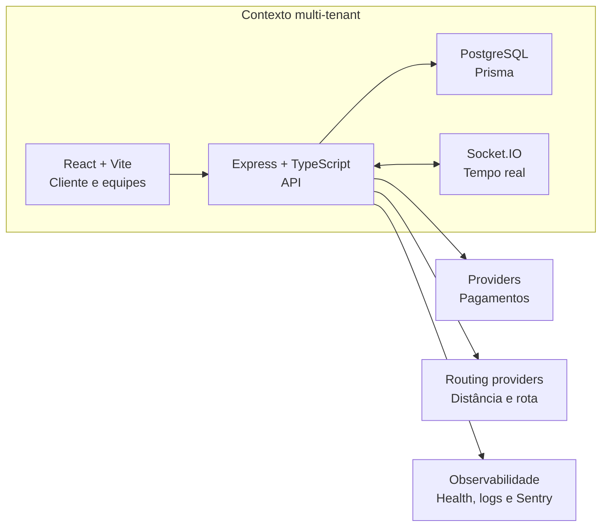
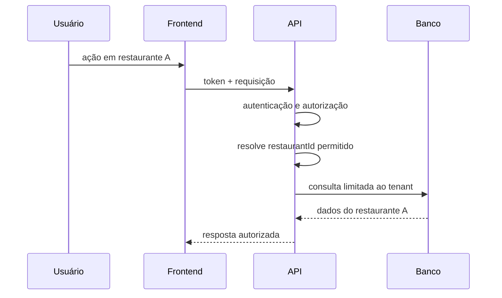
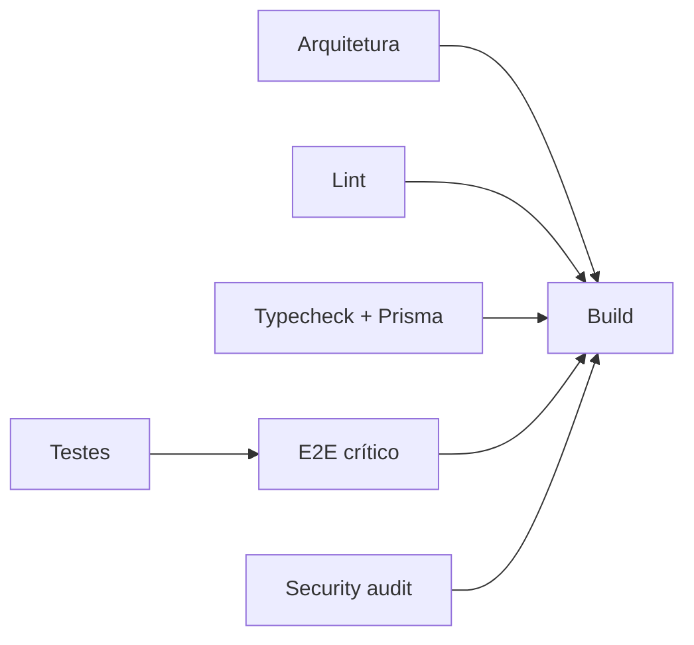

<div align="center">



# Pizza IA Delivery

### SaaS multi-tenant para restaurantes, mesas e delivery

Uma plataforma Full Stack que conecta **cliente, administração, cozinha, garçom, entregador e superadministrador** em uma única operação — do cardápio digital ao pagamento, da mesa por QR Code ao rastreamento GPS.

[](https://www.typescriptlang.org/)
[](https://react.dev/)
[](https://nodejs.org/)
[](https://www.postgresql.org/)
[](https://playwright.dev/)
[](https://www.docker.com/)

</div>

---

## Visão rápida 

O objetivo deste repositório é demonstrar mais do que CRUD. O projeto foi evoluído como um **produto real**, com regras de negócio, múltiplos perfis, pagamentos, isolamento multi-tenant, comunicação em tempo real, rastreamento, testes automatizados e infraestrutura reproduzível.

| Desafio de engenharia | Como o projeto aborda |
| --- | --- |
| Vários restaurantes na mesma plataforma | Isolamento por `restaurantId`, autorização no backend e separação de contexto por tenant |
| Diferentes perfis usando o mesmo sistema | Rotas e experiências específicas para cliente, admin, cozinha, garçom, entregador e superadmin |
| Pedido em canais diferentes | Fluxos próprios para `DELIVERY`, `RETIRADA` e `MESA` |
| Pagamentos com integrações externas | Providers separados, webhooks, reconciliação, reembolso e estados explícitos |
| Operação em tempo real | Socket.IO para mudanças de pedido, cozinha, atendimento e localização |
| Entrega com distância variável | Cotação no servidor, faixas de taxa e abstração de roteamento |
| QR Code de mesa | Sessão vinculada à mesa, atendimento, pedidos e conta compartilhada |
| Evolução sem quebrar o produto | Unitários, integração, E2E, lint, typecheck, migrations e build no CI |
| Código crescendo em várias áreas | Organização por feature e limites arquiteturais verificados automaticamente |

> **As imagens abaixo não são mockups criados à mão.** Elas são capturas do próprio frontend React executado pelo Playwright com fixtures determinísticas. O workflow `README Screenshots` consegue regenerá-las a partir do código atual.

---

# Interface real do projeto

## 1. Cardápio do cliente

O cardápio público é resolvido pelo restaurante/slug, carrega identidade visual, produtos e disponibilidade e mantém o contexto do restaurante durante toda a jornada.



**O que essa tela representa:**

1. resolução do restaurante pelo slug;
2. carregamento das configurações públicas;
3. catálogo vindo da API;
4. categorias, preços e disponibilidade;
5. carrinho e personalizações;
6. experiência responsiva para desktop e celular.

---

## 2. Login responsivo com identidade do restaurante

A tela de autenticação utiliza branding dinâmico do restaurante e foi validada em diferentes larguras de celular. O layout possui tratamento responsivo, imagem de capa, modo claro/escuro e controle de visibilidade da senha.

<p align="center">
  
</p>

O fluxo de autenticação também possui proteção de rotas, recuperação/troca de senha e políticas de acesso conforme o perfil autenticado.

---

## 3. Administração: descontos e fidelidade

O painel administrativo concentra configuração e operação do restaurante. A imagem abaixo mostra uma das áreas reais do sistema: **descontos e fidelidade**.



Nessa área, o administrador consegue trabalhar com promoções de produto, cupons e benefícios de fidelidade. O backend continua sendo a fonte de verdade para as regras e valores efetivos.

---

## 4. Rastreamento da entrega

O cliente acompanha o pedido durante a entrega com dados de rota, entregador, posição mais recente e estimativa de chegada.



O fluxo foi desenhado para que eventos em tempo real acelerem a interface, enquanto o estado persistido no backend continua sendo a referência confiável.

---

## 5. Cartões salvos e experiência de pagamento

O projeto também possui suporte à experiência de cartões salvos por cliente/restaurante, sem armazenar dados sensíveis completos do cartão na aplicação.

<p align="center">
  
</p>

A modelagem de métodos de pagamento do cliente utiliza identificadores do provider, bandeira normalizada, últimos quatro dígitos, validade e definição de cartão padrão.

---

# O produto, passo a passo

## Jornada A — Delivery


1. **Entrada no cardápio** — o cliente acessa a URL do restaurante e o frontend resolve o tenant correto.
2. **Montagem do pedido** — produtos podem ter opções, ingredientes, observações e quantidades.
3. **Cotação** — o servidor recalcula valores relevantes, incluindo descontos, cupons e taxa de entrega.
4. **Identificação/endereço** — delivery valida os dados necessários antes de prosseguir.
5. **Pagamento** — a aplicação escolhe o fluxo compatível com o método e provider configurado.
6. **Cozinha** — o pedido aparece para produção com itens, quantidades, observações e customizações.
7. **Entrega** — o entregador assume o pedido e inicia o compartilhamento autorizado da localização.
8. **Tracking** — o cliente acompanha a rota e a evolução do status.
9. **Conclusão** — o pedido finalizado alimenta histórico, fidelidade e demais regras pós-venda.

## Jornada B — Mesa por QR Code

1. O administrador cria/configura a mesa e disponibiliza seu QR Code.
2. O garçom abre a sessão operacional da mesa.
3. O cliente escaneia o QR e entra diretamente no contexto correto, sem precisar fazer login para pedir na mesa.
4. O cliente monta o pedido usando o mesmo catálogo e as mesmas regras de customização.
5. Antes de concluir, pode seguir conforme as capacidades configuradas da mesa: **adicionar à conta** ou **pagar o pedido agora**.
6. O pedido chega à cozinha identificado como pedido de mesa.
7. O cliente pode acompanhar o status do pedido da mesa.
8. A área flutuante permite acessar atendimento, visualizar a conta e solicitar o fechamento.
9. O fluxo de conta possui regras para evitar concorrência indevida de pagamento dos mesmos itens.

## Jornada C — Operação interna

### Administrador

Gerencia catálogo, categorias, ingredientes, equipe, mesas, pedidos, configurações, descontos, fidelidade, integrações e áreas financeiras.

### Cozinha

Recebe uma fila operacional voltada à produção, incluindo customizações e observações que precisam chegar exatamente como o cliente selecionou.

### Garçom

Opera mesas e chamadas de atendimento sem receber permissões administrativas que não pertencem ao papel de salão.

### Entregador

Visualiza as entregas atribuíveis, retira o pedido, compartilha GPS durante a entrega, trabalha com ocorrências e conclui o pedido com as proteções previstas pelo fluxo.

### Superadministrador

Possui experiência separada para gerenciamento da própria plataforma e dos restaurantes cadastrados.

---

# Principais funcionalidades implementadas

| Área | Funcionalidades |
| --- | --- |
| **Cardápio** | catálogo por restaurante, categorias, disponibilidade, imagens, customizações e observações |
| **Carrinho/checkout** | delivery, retirada, mesa, cotação, endereço e validações |
| **Mesa/QR** | QR Code, abertura de sessão, pedidos, atendimento e conta da mesa |
| **Pedidos** | criação, mudanças de status, ocorrências, confirmação e reembolso |
| **Cliente** | perfil, endereços, favoritos, pedidos e tracking |
| **Promoções** | descontos de produto, cupons e regras de fidelidade |
| **Pagamentos** | PIX/cartão conforme provider, webhooks, reconciliação e métodos salvos |
| **Delivery** | entregador, GPS, rota, estimativa e tracking do cliente |
| **Administração** | catálogo, equipe, configurações, mesas, promoções e operação |
| **Tempo real** | Socket.IO aplicado aos fluxos que precisam de atualização imediata |
| **SaaS** | restaurantes/tenants, planos, faturas e bloqueios operacionais relacionados à plataforma |
| **Automação** | importação de cardápio, suporte com IA e recursos de melhoria de imagem |
| **Confiabilidade** | auditoria, rate limiting, health/readiness, observabilidade e shutdown controlado |

---

# Arquitetura



O projeto segue organização orientada a funcionalidades. A intenção é manter regra de negócio perto do domínio responsável e evitar arquivos globais acumulando responsabilidades.

### Backend

```text
backend/src/modules/<feature>/
  controllers/        traduz HTTP para o caso de uso
  services/           coordena regras e fluxo da aplicação
  repositories/       persistência e consultas
  providers/          gateways e integrações externas
  domain/             regras puras, tipos e contratos
  routes/             definição de endpoints
```

### Frontend

```text
frontend/src/pages/<feature>/
  components/         UI específica da funcionalidade
  hooks/              estado, efeitos e coordenação
  domain/             regras puras e testáveis
  adapters/           conversão de contratos para a UI
  types.ts            tipos da área
```

Essa separação é reforçada pelo documento [ARCHITECTURE.md](ARCHITECTURE.md) e por uma verificação automática de arquitetura executada no CI.

---

# Multi-tenancy e autorização

Um dos pontos centrais do projeto é impedir que um usuário autenticado em um restaurante utilize IDs de outro restaurante para acessar dados que não pertencem ao seu contexto.

A proteção não depende apenas de esconder opções no frontend. O backend aplica o contexto de tenant nas operações relevantes, e os testes cobrem cenários de autorização e isolamento.



---

# Pagamentos

O projeto possui uma camada de pagamentos que evita acoplar toda a aplicação a um único gateway. Existem fluxos e integrações relacionados a **Mercado Pago, Asaas, PagBank e Stripe**, além de serviços de reembolso e checkout por provider.

Entre as preocupações tratadas pelo código estão:

- confirmação assíncrona por webhook;
- validação/assinatura de eventos conforme o provider;
- idempotência para não processar o mesmo evento de pagamento repetidamente;
- reconciliação entre pagamento e pedido;
- reembolso;
- pagamento imediato ou conta da mesa;
- métodos de cartão salvos através de referências seguras do provider.

> Segredos de gateways nunca devem ser versionados. O repositório mantém apenas arquivos `.example` para configuração.

---

# Delivery, distância e GPS

A taxa de entrega pode ser calculada por regras/faixas de distância. O servidor é responsável pela cotação para que o valor não dependa de dados manipuláveis no navegador.

A camada de roteamento foi abstraída para permitir providers diferentes. O repositório possui configuração para roteamento local/produção e suporte a provider externo quando configurado.

No acompanhamento da entrega:

1. o entregador assume um pedido compatível com seu tenant;
2. o navegador solicita permissão de geolocalização;
3. posições autorizadas são enviadas durante a entrega;
4. o cliente recebe atualização da própria entrega;
5. a UI combina status, localização e estimativa de rota;
6. ao concluir, o envio periódico de localização é encerrado.

---

# Segurança

A segurança é tratada em camadas, com mecanismos e testes distribuídos entre autenticação, autorização e infraestrutura. O projeto inclui áreas relacionadas a:

- JWT e renovação de sessão;
- política de senha;
- recuperação/troca de senha;
- MFA em fluxos previstos;
- lockout/proteções contra tentativas abusivas;
- autorização por papel;
- isolamento por restaurante;
- rate limiting;
- CORS e headers de segurança;
- auditoria de ações;
- validações de ambiente;
- proteção de segredos por configuração externa.

---

# Stack técnica

| Camada | Tecnologias principais |
| --- | --- |
| **Frontend** | React 19, Vite, TypeScript, React Router, Styled Components, Axios, Lucide e Socket.IO Client |
| **Backend** | Node.js, Express, TypeScript, Prisma e Socket.IO |
| **Banco** | PostgreSQL + migrations Prisma |
| **Qualidade** | Vitest, Node Test Runner, Playwright, ESLint, TypeScript e auditoria npm |
| **Mapas/rotas** | GPS Web, Leaflet e camada de routing configurável |
| **Infraestrutura** | Docker, Docker Compose, Caddy/Nginx conforme ambiente |
| **Observabilidade** | Sentry, health/readiness, request IDs, logs e alertas |

---

# Estratégia de testes

A regra do projeto é testar cada comportamento na **menor camada capaz de detectar o risco real**.

### 1. Testes unitários

Indicados para cálculo, transformação, regras puras e validações. Exemplos: desconto, checkout, disponibilidade e normalizações.

### 2. Testes de integração

Usados onde o risco depende da fronteira entre módulos, banco, autenticação, tenant, pagamento ou eventos.

### 3. Testes E2E

Usados para jornadas que atravessam várias telas/papéis. O comando crítico atual cobre oito specs essenciais:

```text
password-policy.spec.ts
system-availability.spec.ts
table-qr-role-flow.spec.ts
kitchen-order-customizations.spec.ts
waiter-operations.spec.ts
courier-operations.spec.ts
promotions-loyalty.spec.ts
super-admin-platform.spec.ts
```

### 4. Screenshots do README também vêm dos E2E

O workflow `.github/workflows/readme-screenshots.yml` executa o frontend com Playwright e grava as capturas em:

```text
docs/assets/screenshots/
  login-mobile.png
  customer-menu.png
  admin-promotions-loyalty.png
  delivery-tracking.png
```

Assim, a documentação visual pode evoluir junto com a interface.

Mais detalhes: [TESTING.md](TESTING.md).

---

# CI e gates de qualidade

O GitHub Actions executa jobs independentes para detectar problemas cedo:



A pipeline atual verifica:

- instalação determinística das dependências;
- limites arquiteturais;
- catálogo de scripts operacionais;
- ESLint sem warnings no CI;
- typecheck backend e frontend;
- `prisma validate`;
- aplicação de migrations em um PostgreSQL limpo;
- testes backend;
- testes frontend com thresholds de cobertura;
- E2E críticos em Chromium;
- `npm audit` para vulnerabilidades de nível alto;
- build backend e frontend;
- orçamento de bundle.

Para executar a validação do monorepo localmente:

```bash
npm run ci
```

Em uma máquina limpa, instale tudo e valide com:

```bash
npm run ci:clean
```

E para as jornadas E2E críticas:

```bash
npm run test:e2e:critical
```

---

# Executando localmente

## Pré-requisitos

- Node.js compatível com o projeto;
- npm;
- PostgreSQL;
- Docker/Docker Compose se quiser utilizar os ambientes em containers.

## 1. Configure o backend

Use `backend/.env.example` como referência e mantenha credenciais reais apenas no arquivo local ignorado pelo Git.

O banco de desenvolvimento utilizado pelo projeto é `pizza_ai`.

## 2. Instale as dependências

```bash
npm --prefix backend ci
npm --prefix frontend ci
```

O backend gera o Prisma Client durante a instalação.

## 3. Prepare o banco

Valide o schema e aplique as migrations adequadas ao seu ambiente. Em ambientes de produção/CI, o projeto utiliza `prisma migrate deploy`.

## 4. Inicie backend e frontend

Em terminais separados:

```bash
npm --prefix backend run dev
```

```bash
npm --prefix frontend run dev
```

| Serviço | Endereço padrão |
| --- | --- |
| Frontend | `http://localhost:5173` |
| Backend | `http://localhost:3000` |
| Health | `http://localhost:3000/health` |
| Readiness | `http://localhost:3000/ready` |
| PostgreSQL | `localhost:5432` |

> Evite executar ao mesmo tempo o backend nativo e outro backend Docker publicando a mesma porta `3000`.

---

# Docker e produção

O repositório possui configurações diferentes para desenvolvimento, roteamento e produção. A documentação operacional cobre deploy, banco gerenciado, roteamento e preparação para escala.

Documentos importantes:

- [Arquitetura](ARCHITECTURE.md)
- [Estratégia de testes](TESTING.md)
- [Deploy e rollback](DEPLOY.md)
- [Supabase + Prisma](SUPABASE_SETUP.md)
- [Routing/GPS local](ROUTING_GPS_SETUP.md)
- [Routing em produção](ROUTING_PRODUCTION.md)
- [Checklist de infraestrutura para 100 restaurantes](INFRA_CHECKLIST_100_RESTAURANTS.md)
- [Teste de carga](LOAD_TEST_100_RESTAURANTS.md)
- [Critérios de go-live](GO_LIVE_CRITERIA_100_RESTAURANTS.md)

---

# Estrutura do repositório

```text
.
├── backend/
│   ├── prisma/                     schema e migrations
│   ├── scripts/                    tarefas operacionais controladas
│   └── src/modules/                funcionalidades do backend
│
├── frontend/
│   ├── e2e/                        jornadas Playwright
│   └── src/
│       ├── pages/                  experiências por papel/feature
│       ├── Services/               clientes HTTP
│       ├── contexts/               sessão e estado global
│       ├── routes/                 autorização e composição de rotas
│       └── modules/features/       módulos reutilizáveis
│
├── docs/assets/                    diagramas e screenshots reais
├── scripts/                        gates do monorepo
├── deploy/                         configuração de proxy/HTTPS
├── docker-compose*.yml             ambientes containerizados
├── ARCHITECTURE.md
├── TESTING.md
└── DEPLOY.md
```

---

# O que eu quis demonstrar com este projeto

Este projeto foi construído para praticar e demonstrar competências que aparecem em sistemas de produção:

- modelagem de domínio;
- APIs REST;
- autenticação e autorização;
- multi-tenancy;
- regras de negócio complexas;
- integrações de pagamentos;
- comunicação em tempo real;
- React com componentes e hooks organizados;
- banco relacional e migrations;
- testes unitários, integração e E2E;
- CI e automação;
- Docker e preocupações de deploy;
- observabilidade;
- refatoração incremental sem reescrever toda a aplicação.

O código continua evoluindo, mas a preocupação central é que cada nova funcionalidade seja incorporada sem perder **isolamento, testabilidade e clareza de responsabilidades**.

---

# Roadmap técnico

- [ ] Redis adapter/sticky sessions para escala horizontal do Socket.IO.
- [ ] OpenAPI formal para contratos HTTP.
- [ ] Catálogo versionado de eventos Socket.IO.
- [ ] Métricas e tracing distribuído mais completos.
- [ ] Ambientes efêmeros de preview no pipeline.
- [ ] Aplicativo móvel dedicado para cenários de tracking em background.

---

# Segurança de configuração

**Nunca envie `.env`, tokens, senhas, chaves de API ou credenciais de gateways para o Git.**

O repositório disponibiliza arquivos `.example` para documentar as variáveis necessárias sem publicar segredos.

---

## Autor

Desenvolvido por **Samuel Gomes**.

[](https://github.com/samuelggds)

---

<div align="center">
  <strong>Um projeto Full Stack pensado como produto: da primeira visita ao restaurante até o pedido entregue.</strong>
</div>
