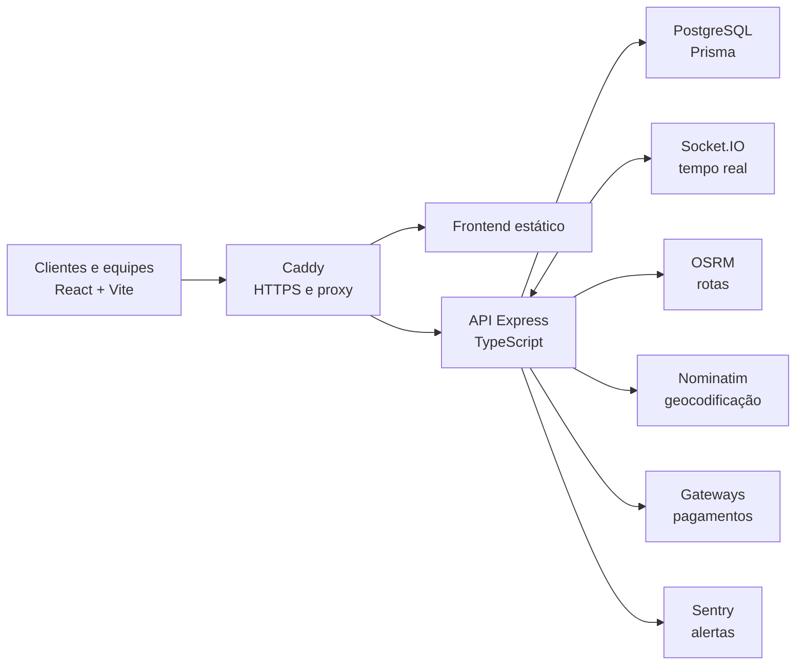

<div align="center">


# Pizza IA Delivery

### Plataforma completa para restaurantes, mesas e delivery

Do cardápio digital à cozinha, do pagamento ao rastreamento GPS: uma solução multi-restaurante construída com TypeScript de ponta a ponta.

[](https://www.typescriptlang.org/)
[](https://react.dev/)
[](https://nodejs.org/)
[](https://www.postgresql.org/)
[](https://www.docker.com/)

</div>

## Sobre o projeto

O **Pizza IA Delivery** não é apenas uma tela de pedidos. É uma plataforma SaaS multi-tenant que conecta toda a operação de um restaurante: cliente, administrador, cozinha, garçom, entregador e superadministrador.

O sistema atende **delivery, retirada e consumo em mesa por QR Code**, oferecendo pagamentos, conta compartilhada, promoções, fidelidade, rastreamento em tempo real, cobrança da assinatura do restaurante e ferramentas de automação.

> Este repositório demonstra decisões pensadas para um produto real: isolamento por restaurante, pagamentos idempotentes, eventos em tempo real, observabilidade, deploy seguro e testes proporcionais ao risco.

## O que já foi construído

| Área | Entregas implementadas |
| --- | --- |
| **Experiência do cliente** | Cardápio por restaurante, carrinho, personalização, endereços, favoritos, perfil e tracking |
| **Pedidos** | Fluxos de `DELIVERY`, `RETIRADA` e `MESA`, disponibilidade, capacidade, ocorrências e reembolso |
| **Mesa e QR Code** | Sessões, participantes, PIN, chamadas de garçom, conta e divisão de pagamento |
| **Operação** | Painéis para administração, cozinha, garçom, entregador e superadmin |
| **Tempo real** | Socket.IO para pedidos, cozinha, salão, chat e GPS, com isolamento por restaurante |
| **Entrega inteligente** | GPS, tracking, polling de contingência, OSRM para rotas e Nominatim para geocodificação |
| **Pagamentos** | Fluxos para Mercado Pago, Asaas, PagBank e Stripe, com webhooks e reconciliação |
| **Relacionamento** | Cupons, promoções, carteira de fidelidade, resgates e favoritos |
| **Gestão SaaS** | Planos, assinaturas, faturas, cobrança e bloqueio por inadimplência |
| **Automação** | Importação de cardápio, suporte com IA e aprimoramento de imagens |
| **Confiabilidade** | MFA, lockout, auditoria, rate limiting, healthchecks, Sentry, jobs e shutdown gracioso |

## A jornada completa


### Delivery

1. O cliente acessa o cardápio exclusivo do restaurante.
2. Personaliza produtos, informa o endereço e escolhe o pagamento.
3. O pedido chega em tempo real à operação e à cozinha.
4. O entregador retira o pedido e compartilha sua localização autorizada.
5. O cliente acompanha o trajeto e recebe a confirmação da entrega.
6. Cupons, favoritos e fidelidade ajudam a gerar recorrência.

### Mesa por QR Code

1. O cliente lê o QR Code e entra na mesa correta.
2. Participantes podem ser identificados na mesma sessão.
3. Pedidos chegam à cozinha e chamadas chegam ao garçom.
4. A conta permite pagar tudo, os próprios itens, itens selecionados ou dividir igualmente.
5. Reservas financeiras impedem duas pessoas de pagar o mesmo item.

## Arquitetura



O código é organizado por funcionalidades. No backend, controllers traduzem HTTP, services coordenam casos de uso, repositories cuidam da persistência e providers isolam integrações externas. No frontend, páginas compõem a experiência enquanto hooks, adaptadores, regras puras e services mantêm responsabilidades separadas.

```text
backend/src/modules/<feature>/
  controllers/       entrada e saída HTTP
  services/          casos de uso
  repositories/      persistência
  providers/         integrações externas
  domain/            regras puras e contratos
  routes/            endpoints

frontend/src/pages/<feature>/
  components/        interface da funcionalidade
  hooks/             estado e efeitos
  domain/            regras testáveis
  adapters/          tradução de contratos
  types.ts           tipos da área
```

Mais detalhes: [ARCHITECTURE.md](ARCHITECTURE.md).

## Decisões técnicas que fazem diferença

- **Multi-tenancy:** dados, endpoints e salas Socket.IO são isolados por restaurante.
- **Banco como fonte de verdade:** eventos aceleram a interface, mas estados críticos permanecem persistidos.
- **Pagamentos resilientes:** webhooks assinados, estados explícitos, idempotência e reconciliação.
- **Segurança em camadas:** Helmet, CORS, rate limiting, MFA, lockout e autorização no servidor.
- **Operação observável:** request ID, Sentry, alertas, `/health`, `/ready` e shutdown gracioso.
- **Roteamento privado:** OSRM e Nominatim na rede interna, sem depender de servidores públicos de demonstração.
- **Evolução segura:** migrations versionadas, backups, smoke tests e rollback no processo de deploy.

## Stack

| Camada | Tecnologias |
| --- | --- |
| Frontend | React, Vite, TypeScript, React Router, Styled Components, Axios e Socket.IO Client |
| Backend | Node.js, Express, TypeScript, Prisma e Socket.IO |
| Dados | PostgreSQL, migrations Prisma e suporte a Supabase como banco gerenciado |
| Mapas e rotas | GPS Web, OSRM, Nominatim e tiles configuráveis |
| Infraestrutura | Docker, Docker Compose, Caddy e Nginx |
| Qualidade | Vitest, Playwright, ESLint, Prettier, typecheck e auditoria de dependências |
| Observabilidade | Sentry, healthchecks, request IDs, logs e alertas críticos |

## Papéis e experiências

| Papel | Experiência principal |
| --- | --- |
| Cliente | Cardápio, pedido, pagamento, perfil, fidelidade e tracking |
| Administrador | Catálogo, pedidos, equipe, configurações, promoções e financeiro |
| Cozinha | Fila de produção com itens, observações e customizações |
| Garçom | Mesas, chamadas de atendimento e fechamento de contas |
| Entregador | Retirada, ocorrências, GPS e conclusão da entrega |
| Superadministrador | Gestão dos restaurantes e da plataforma |

## Qualidade e testes

O projeto aplica a menor camada de teste capaz de detectar o risco real:

- **Unitários:** cálculos, transformações, validações e regras puras.
- **Integração:** banco, autenticação, tenant, pagamentos e Socket.IO.
- **E2E:** jornadas críticas entre telas e papéis.

As cinco jornadas E2E críticas cobrem QR/mesa, customizações na cozinha, operação do garçom, entrega com GPS e promoções/fidelidade.

```bash
npm run lint
npm run typecheck
npm test
npm run test:e2e:critical
npm run build
```

Estratégia completa: [TESTING.md](TESTING.md).

## Executando localmente

### Pré-requisitos

- Node.js e npm
- Docker Engine
- Docker Compose

Crie `.env.docker` a partir de `.env.docker.example` e preencha os valores do seu ambiente:

```bash
docker compose up --build
```

| Serviço | Endereço local |
| --- | --- |
| Frontend | http://localhost:5173 |
| Backend | http://localhost:3000 |
| Healthcheck | http://localhost:3000/health |
| Readiness | http://localhost:3000/ready |
| PostgreSQL | localhost:5432 |

Para hot reload:

```bash
docker compose -f docker-compose.dev.yml up --build
```

Nesse modo, o backend usa Nodemon e o frontend usa Vite/HMR na porta `5174`. Para roteamento próprio, siga [ROUTING_GPS_SETUP.md](ROUTING_GPS_SETUP.md).

## Produção

A topologia recomendada utiliza `docker-compose.production.yml`. O Caddy publica apenas HTTP/HTTPS; backend, PostgreSQL, OSRM e Nominatim permanecem em redes privadas.

O processo inclui validação de ambiente, `prisma migrate deploy`, healthchecks, certificados automáticos, WebSocket, backups, smoke tests e rollback.

> Enquanto o Socket.IO utilizar o adapter em memória, a produção deve operar com uma réplica do backend. Redis/sticky sessions é o próximo passo para escala horizontal segura.

Documentos operacionais:

- [Deploy e rollback](DEPLOY.md)
- [Supabase com Express e Prisma](SUPABASE_SETUP.md)
- [Rotas e GPS em produção](ROUTING_PRODUCTION.md)
- [Checklist para 100 restaurantes](INFRA_CHECKLIST_100_RESTAURANTS.md)
- [Teste de carga](LOAD_TEST_100_RESTAURANTS.md)
- [Critérios de go-live](GO_LIVE_CRITERIA_100_RESTAURANTS.md)

## Estrutura do repositório

```text
.
├── backend/                    API, domínio, Prisma, sockets e jobs
├── frontend/                   SPA React, painéis e testes E2E
├── deploy/                     proxy e HTTPS com Caddy
├── docs/assets/                imagens desta apresentação
├── scripts/                    verificações do monorepo
├── docker-compose*.yml         ambientes local, dev, routing e produção
├── ARCHITECTURE.md             limites arquiteturais
├── DEPLOY.md                   runbook de produção
└── TESTING.md                  estratégia de qualidade
```

## Roadmap técnico

- [ ] Redis adapter e coordenação de jobs para múltiplas réplicas.
- [ ] Contrato OpenAPI e catálogo formal de eventos Socket.IO.
- [ ] Métricas de negócio e tracing distribuído mais completos.
- [ ] Pipeline CI/CD com ambientes efêmeros e evidência automática de release.
- [ ] Aplicativo móvel dedicado para melhorar o rastreamento em background.

## Segurança

**Nunca envie arquivos `.env`, tokens, senhas ou credenciais de gateways para o Git.** Use os arquivos `.example`, ambientes separados e credenciais de teste durante o desenvolvimento.

## Autor

Desenvolvido por **Samuel Gomes**.

[](https://github.com/samuelggds)

---

<div align="center">
  <strong>Engenharia aplicada a uma operação real, da primeira visita à entrega concluída.</strong>
</div>
