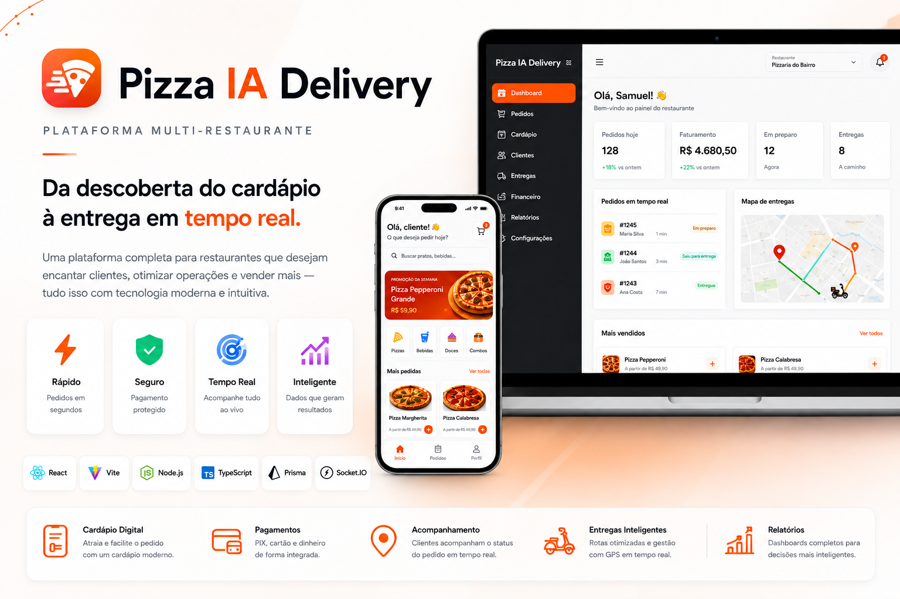
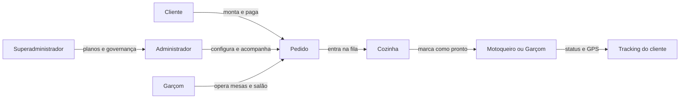
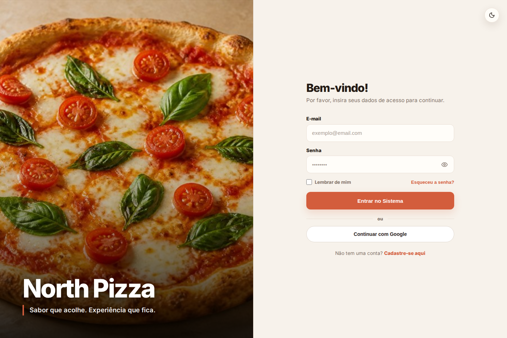
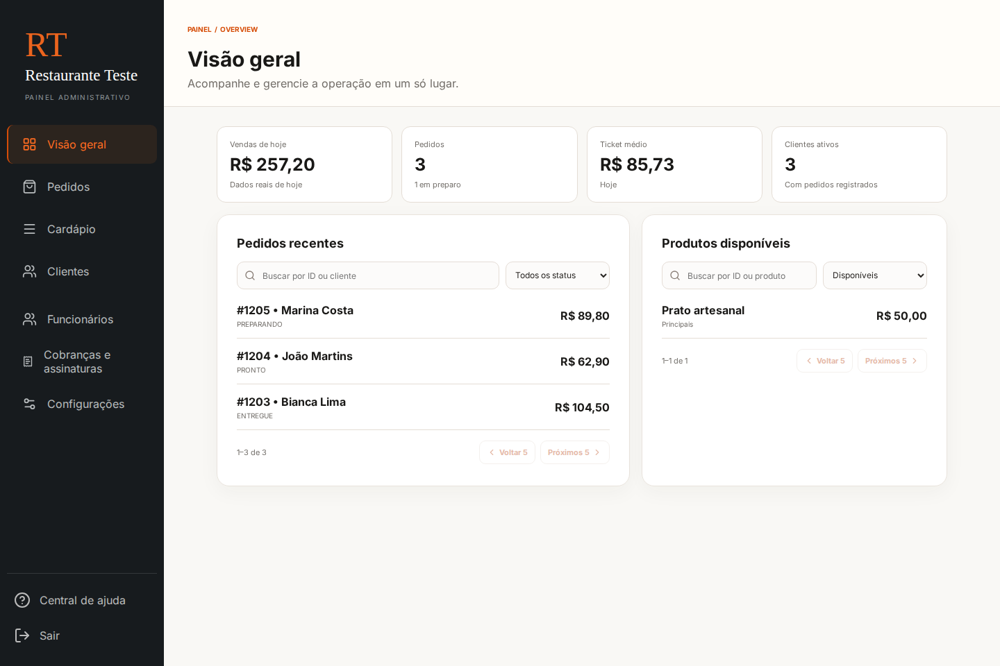
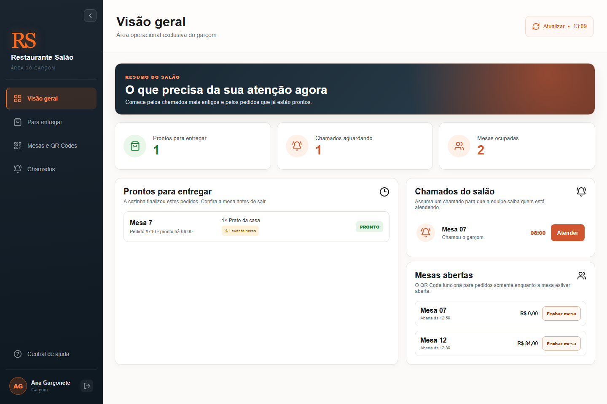
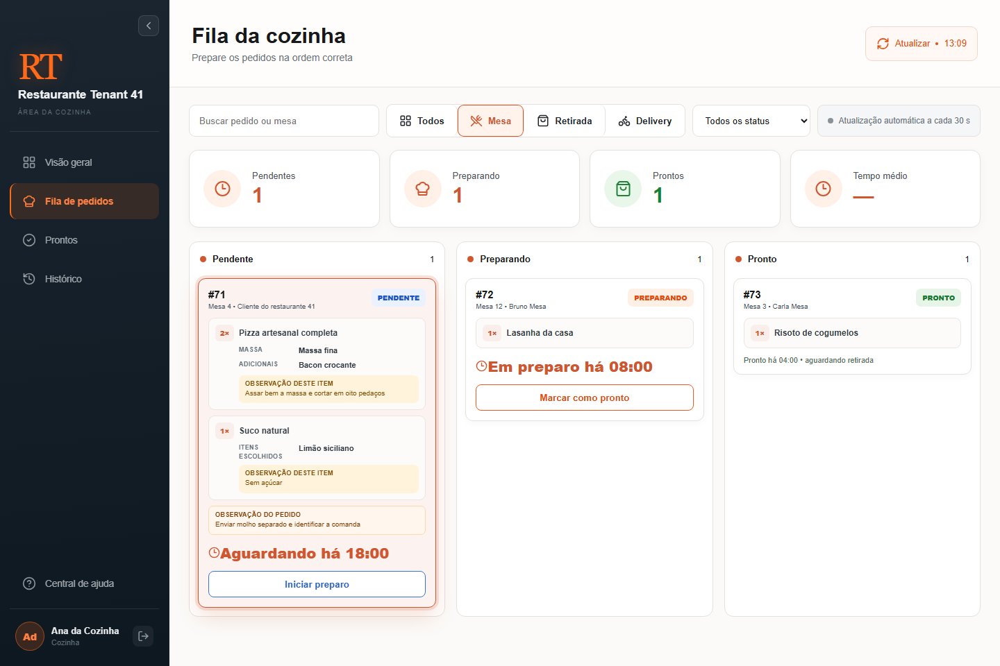
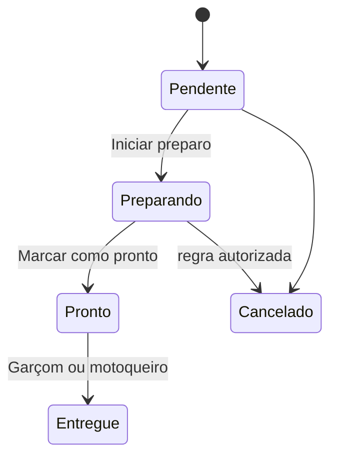
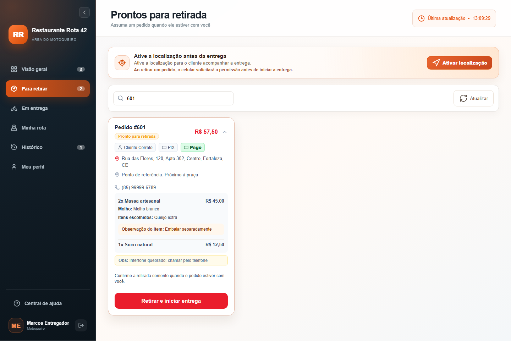
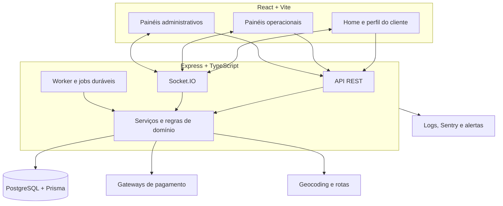
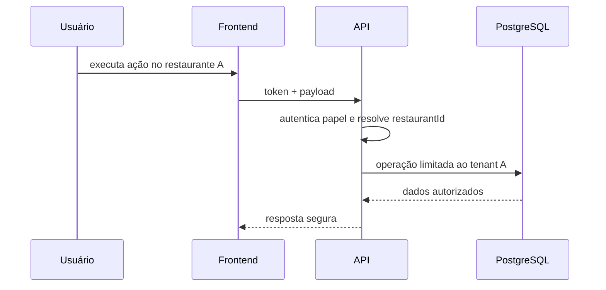

<div align="center">



# Pizza IA Delivery

### Plataforma SaaS multi-restaurante para pedidos, mesas, cozinha e delivery em tempo real

Do primeiro acesso ao cardápio até a entrega: uma operação integrada para **clientes, administradores, garçons, cozinha, motoqueiros e superadministradores**.

[](https://github.com/samuelggds/Projeto-Restaurants/actions/workflows/ci.yml)
[](https://www.typescriptlang.org/)
[](https://react.dev/)
[](https://nodejs.org/)
[](https://www.postgresql.org/)
[](https://playwright.dev/)

<p>
  <a href="#visão-do-produto">Produto</a> •
  <a href="#experiência-por-painel">Painéis</a> •
  <a href="#arquitetura">Arquitetura</a> •
  <a href="#segurança">Segurança</a> •
  <a href="#qualidade-e-testes">Testes</a> •
  <a href="#executando-localmente">Executar</a>
</p>

</div>

---

## Visão do produto

O **Pizza IA Delivery** foi desenvolvido como um produto operacional completo, não apenas como um CRUD. Cada restaurante possui sua identidade, configurações, catálogo, equipe, pedidos e integrações isolados por tenant. A plataforma conecta o atendimento público às áreas internas e mantém todos os perfis trabalhando sobre a mesma fonte de verdade.

| Pilar                      | O que está implementado                                                                  |
| -------------------------- | ---------------------------------------------------------------------------------------- |
| **Multi-restaurante**      | Contexto por `restaurantId`, slug público, branding e dados isolados por tenant          |
| **Venda omnichannel**      | Pedidos de `DELIVERY`, `RETIRADA` e `MESA` com regras próprias                           |
| **Operação em tempo real** | Socket.IO para pedidos, cozinha, salão, suporte e localização da entrega                 |
| **Cardápio flexível**      | Categorias, estoque, imagens, grupos de opções, ingredientes e observações               |
| **Pagamentos**             | Pix, cartão, pagamento na entrega, conta da mesa, webhooks e reconciliação               |
| **Entrega inteligente**    | Cotação por distância, providers de rota, GPS e acompanhamento do cliente                |
| **Fidelização**            | Promoções por produto, cupons, carteira e campanhas de compras recorrentes               |
| **SaaS**                   | Planos, mensalidades, bloqueios financeiros e administração da plataforma                |
| **Confiabilidade**         | Testes automatizados, auditoria, observabilidade, health checks e CI completo            |
| **Impressão de cozinha**   | Fila PostgreSQL durável, Print Agent local, 58/80 mm, retry e isolamento por restaurante |

### Como os perfis se conectam



> As capturas deste README vêm do **frontend React real**, executado pelo Playwright com dados determinísticos. Elas não são mockups desenhados separadamente e podem ser regeneradas pelo workflow `README Screenshots`.

---

# Experiência por painel

## 1. Home e cardápio do cliente


A Home é a vitrine digital de cada restaurante. O slug identifica o tenant, aplica a identidade visual correta e carrega somente produtos e configurações públicas daquele estabelecimento.

### O que o cliente encontra

- cabeçalho com restaurante, endereço de entrega, horário e sacola;
- categorias com navegação visual;
- cards de produtos com preço, disponibilidade e favoritos;
- montagem de itens com grupos obrigatórios ou opcionais;
- ingredientes, adicionais, observação e quantidade;
- campanhas, cupons e fidelidade quando habilitados;
- escolha entre delivery, retirada ou pedido por mesa;
- checkout com recálculo de preços no servidor.

### O que acontece por trás da interface

| Etapa             | Garantia do sistema                                                               |
| ----------------- | --------------------------------------------------------------------------------- |
| Resolução da loja | O restaurante é localizado pelo slug e o contexto acompanha toda a jornada        |
| Catálogo          | Produtos, categorias e imagens são filtrados pelo tenant e disponibilidade        |
| Montagem          | Regras de seleção são validadas novamente no backend                              |
| Cotação           | Subtotal, descontos, cupom e entrega não dependem do valor enviado pelo navegador |
| Pedido            | O canal escolhido determina endereço, mesa, pagamento e fluxo operacional         |

---

## 2. Login responsivo — desktop e mobile

<table>
  <tr>
    <td width="68%" valign="top">
      
    </td>
    <td width="32%" valign="top">
      
    </td>
  </tr>
</table>

A autenticação preserva a identidade do restaurante em qualquer tamanho de tela. O layout muda de composição no celular, mas mantém o mesmo formulário, feedback e acessibilidade.

### Recursos da autenticação

- branding dinâmico com nome, descrição, cor e imagem de capa;
- layout responsivo testado de `320 px` a `1440 px`;
- login tradicional e integração opcional com Google;
- controle de visibilidade da senha e opção “lembrar de mim”;
- recuperação e troca obrigatória de senha;
- MFA para funções administrativas configuradas;
- lockout progressivo contra tentativas abusivas;
- redirecionamento seguro de acordo com o papel autenticado;
- modo claro/escuro sem duplicar a regra de autenticação.

### Destino após o login

| Papel                  | Área principal                                     |
| ---------------------- | -------------------------------------------------- |
| Cliente                | Home ou destino protegido solicitado anteriormente |
| Administrador          | `/admin`                                           |
| Funcionário da cozinha | `/kitchen`                                         |
| Garçom                 | `/waiter`                                          |
| Motoqueiro             | `/courier`                                         |
| Superadministrador     | `/super_admin`                                     |

---

## 3. Painel do administrador



O painel administrativo reúne gestão e operação em uma única experiência. A visão geral apresenta vendas do dia, volume de pedidos, ticket médio, clientes ativos, pedidos recentes e produtos disponíveis.

### Áreas do painel

| Área                        | Responsabilidade                                                    |
| --------------------------- | ------------------------------------------------------------------- |
| **Visão geral**             | Indicadores do dia, pedidos recentes e disponibilidade do catálogo  |
| **Pedidos**                 | Busca, filtros, status, pagamento, cancelamento e reembolso         |
| **Cardápio**                | Produtos, categorias, preços, estoque, imagens e opções de montagem |
| **Clientes**                | Histórico de consumo, dados públicos e relacionamento               |
| **Funcionários**            | Convites, funções, ativação e permissões da equipe                  |
| **Cobranças e assinaturas** | Plano contratado, mensalidade, faturas e regularização              |
| **Configurações**           | Marca, negócio, endereço, horários, operação e integrações          |

### Configurações disponíveis

- marca, logotipo, capa e cor principal;
- razão social, documento e contatos comerciais;
- endereço e horários de funcionamento;
- aceite automático, tempo médio e limite de pedidos simultâneos;
- delivery, retirada, taxa por distância e frete grátis;
- mesas, QR Codes, chamadas e conta compartilhada;
- WhatsApp e notificações de status;
- provedores de Pix e cartão;
- redes sociais, aparência e SEO;
- equipe, permissões e segurança.

### Promoções e fidelidade

<details>
  <summary><strong>Ver a área completa de descontos e fidelidade</strong></summary>
  <br />
  
</details>

O administrador pode aplicar descontos percentuais ou fixos em produtos, agendar campanhas e criar benefícios liberados após uma quantidade configurável de pedidos pagos e entregues. O cliente acompanha o progresso e usa o benefício elegível no checkout.

---

## 4. Painel do garçom



O painel do garçom prioriza o que precisa de atenção no salão. A interface separa a operação diária das configurações administrativas para que o funcionário execute somente ações compatíveis com sua função.

### Visão geral do salão

- pedidos prontos aguardando entrega à mesa;
- chamados ainda não assumidos;
- quantidade de mesas ocupadas;
- observações importantes, como talheres ou atendimento especial;
- mesas abertas, horário de abertura e valor atual da conta.

### Fluxos disponíveis

| Seção                | Ações principais                                                   |
| -------------------- | ------------------------------------------------------------------ |
| **Para entregar**    | Filtrar pedidos prontos, conferir mesa e marcar entrega ao cliente |
| **Mesas e QR Codes** | Abrir/fechar sessão, visualizar QR e consultar estado operacional  |
| **Chamados**         | Assumir, acompanhar e concluir solicitações de garçom ou conta     |
| **Conta da mesa**    | Consultar itens, pagamentos, saldo e meios presenciais permitidos  |

O QR Code só libera pedidos enquanto a sessão da mesa estiver válida. O fechamento respeita pedidos, pagamentos e saldo pendentes, reduzindo divergências entre o salão e o sistema.

---

## 5. Painel da cozinha



A cozinha recebe uma fila visual pensada para produção. Cada pedido preserva canal, mesa ou entrega, quantidades, montagem, adicionais e observações exatamente como foram confirmados.

### Organização da fila

- colunas simultâneas de **Pendente**, **Preparando** e **Pronto**;
- filtros por mesa, retirada e delivery;
- busca por pedido, produto, ingrediente ou mesa;
- separação entre fila atual, pedidos prontos e histórico;
- atualização manual, automática e por eventos em tempo real;
- tempo de espera destacado para priorização operacional.

### Ciclo do pedido na cozinha



Preços de adicionais não são usados como distração na tela operacional: a cozinha recebe o que deve preparar, enquanto regras financeiras permanecem nas áreas apropriadas.

---

## 6. Painel do motoqueiro



O painel do motoqueiro acompanha todo o turno: retirada, entrega ativa, rota, histórico e perfil. Somente pedidos de delivery pertencentes ao restaurante correto podem aparecer na fila.

### Recursos da entrega

- lista de pedidos prontos para retirada;
- endereço, ponto de referência e contato do cliente;
- itens, montagem e observações do pedido;
- confirmação de retirada antes de iniciar a rota;
- geolocalização autorizada somente durante a entrega;
- mapa com posição atual, destino e trajeto estimado;
- código de confirmação para concluir a entrega;
- interrupção do compartilhamento de GPS após a finalização;
- histórico e resumo financeiro do entregador.

### Privacidade e isolamento

O backend valida conta ativa, papel, entregador atribuído, tenant e estado do pedido antes de aceitar posições. Eventos de localização são enviados apenas às salas autorizadas do pedido, do cliente e da administração daquele restaurante.

---

## 7. Acompanhamento da entrega pelo cliente


O cliente acompanha o próprio pedido com status, nome do entregador, contato, última posição válida e estimativa de chegada. Socket.IO acelera a atualização da tela, enquanto o estado persistido no backend continua sendo a fonte confiável.

---

## 8. Superadministração da plataforma

O superadministrador trabalha em uma experiência separada da operação dos restaurantes. Essa camada gerencia a própria plataforma SaaS e possui proteções adicionais.

- cadastro e acompanhamento de restaurantes;
- catálogo de planos e funcionalidades;
- faturas e situação financeira dos tenants;
- manutenção e disponibilidade global;
- suporte de plataforma separado do suporte interno do restaurante;
- promoção e administração de contas com MFA obrigatório;
- auditoria de alterações sensíveis e proteção do último `SUPER_ADMIN` ativo.

---

# Jornadas principais

## Delivery


1. O cliente acessa o slug do restaurante.
2. A API entrega identidade, catálogo e capacidades públicas do tenant.
3. O cliente monta os itens e informa endereço ou retirada.
4. O servidor recalcula produtos, adicionais, descontos, cupom e entrega.
5. O pagamento segue o provider configurado ou a regra de pagamento na entrega.
6. A cozinha recebe o pedido e atualiza seu estado.
7. O motoqueiro confirma a retirada e compartilha localização autorizada.
8. O cliente acompanha a rota até a confirmação da entrega.
9. O pedido concluído alimenta histórico e progresso de fidelidade.

## Mesa por QR Code

1. O administrador cadastra a mesa e disponibiliza seu QR Code.
2. O garçom abre uma sessão operacional.
3. O cliente entra no contexto da mesa sem precisar criar uma conta para pedir.
4. Os participantes adicionam itens usando o mesmo catálogo do restaurante.
5. O pedido chega à cozinha identificado como `MESA`.
6. Chamados de garçom e conta aparecem em tempo real no salão.
7. A conta organiza itens e pagamentos por participante.
8. O fechamento só ocorre quando as regras financeiras e operacionais permitem.

## Pagamento e confirmação

1. O frontend solicita uma cotação ao backend.
2. O backend valida tenant, valores, método e provider.
3. A cobrança é criada com idempotência.
4. Webhook ou reconciliação confirma o estado externo.
5. Pedido e pagamento avançam por transições explícitas.
6. Cancelamentos elegíveis acionam o fluxo de reembolso.

---

# Arquitetura



## Organização do backend

```text
backend/src/modules/<feature>/
├── controllers/        entrada HTTP e respostas
├── services/           casos de uso e coordenação
├── repositories/       persistência e consultas
├── providers/          gateways e integrações externas
├── domain/             regras puras, contratos e estados
└── routes/             endpoints e middlewares
```

O backend concentra as regras que não podem depender do navegador: autorização, tenant, preços, pagamentos, transições de pedido, mesa, entrega e auditoria.

## Organização do frontend

```text
frontend/src/pages/<feature>/
├── components/         interface específica da área
├── hooks/              estado, efeitos e sincronização
├── domain/             regras puras testáveis
├── adapters/           API → modelo de apresentação
├── styles.ts           estilos isolados por experiência
└── types.ts            contratos locais
```

Mais detalhes estão em [ARCHITECTURE.md](ARCHITECTURE.md).

## Multi-tenancy

O isolamento não depende de esconder botões no frontend. Rotas privadas resolvem o tenant permitido a partir da sessão autenticada, e repositórios aplicam esse contexto nas consultas e alterações.

O modelo de ameaça, as invariantes, as superfícies revisadas e a matriz de testes estão documentados em [SECURITY_MULTI_TENANT_AUDIT.md](docs/SECURITY_MULTI_TENANT_AUDIT.md).



## Tempo real

Eventos são usados onde atualização imediata agrega valor:

- mudança de status de pedido;
- fila da cozinha;
- chamados e mesas do salão;
- painel administrativo;
- tracking da entrega;
- suporte interno e de plataforma.

O realtime não substitui a persistência. Ao reconectar ou receber um evento importante, a interface pode reconciliar o estado com a API.

---

# Pagamentos, rotas e integrações

## Pagamentos

A camada de providers evita acoplar todo o produto a um único gateway. O projeto contém fluxos para **Mercado Pago, Asaas, PagBank e Stripe**, conforme a finalidade e configuração do restaurante/plataforma.

- webhooks validados;
- idempotência de cobrança e processamento;
- reconciliação automática;
- Pix e cartão online;
- pagamento presencial em dinheiro ou maquininha;
- conta e divisão de pagamento por mesa;
- reembolso e estados de falha explícitos;
- credenciais criptografadas e externas ao repositório;
- cartões salvos somente por referência segura do provider, bandeira e últimos dígitos.

## Distância, taxa e GPS

- a cotação de delivery é calculada no servidor;
- regras podem usar faixas de distância e frete grátis;
- providers de roteamento são configuráveis;
- o projeto suporta Geoapify e infraestrutura própria com OSRM/Nominatim;
- posições são validadas e possuem retenção configurável;
- o compartilhamento termina quando a entrega deixa de estar ativa.

## Automação e IA

O projeto possui áreas para importação de cardápio, suporte assistido e melhoria controlada de imagens. Recursos de IA permanecem opcionais, possuem limites de uso e não substituem regras determinísticas de segurança ou cobrança.

---

# Segurança

A segurança é aplicada em camadas e coberta por testes de comportamento.

| Camada          | Proteções principais                                                                |
| --------------- | ----------------------------------------------------------------------------------- |
| **Sessão**      | Access token curto, refresh rotativo, cookie `HttpOnly` e revogação por versão      |
| **Credenciais** | Política forte, bcrypt, recuperação controlada e troca obrigatória                  |
| **MFA**         | Obrigatório para papéis configurados, desafios com expiração e limite de tentativas |
| **Autorização** | Papel, subpapel, conta ativa, tenant e recurso verificados no backend               |
| **Abuso**       | Rate limiting, lockout progressivo e limites específicos por fluxo                  |
| **HTTP**        | Helmet, CORS restrito, proteção cross-site e limites de payload                     |
| **Pagamentos**  | Assinatura, idempotência, conferência de valor/moeda/provider e reconciliação       |
| **Telemetria**  | Redação de tokens, PII, credenciais, query strings e stacks sensíveis               |
| **Produção**    | Validação de ambiente, HTTPS, segredos independentes e fingerprint do banco         |

Nunca versione `.env`, tokens, senhas, chaves privadas ou credenciais dos gateways. Utilize os arquivos `.example` apenas como contrato de configuração.

---

# Stack técnica

| Camada          | Tecnologias                                                                 |
| --------------- | --------------------------------------------------------------------------- |
| Frontend        | React 19, Vite, TypeScript, React Router, Styled Components, Axios e Lucide |
| Backend         | Node.js, Express 5, TypeScript, Prisma e Socket.IO                          |
| Banco           | PostgreSQL + migrations Prisma                                              |
| Mapas           | Leaflet, Geolocation API e providers de routing                             |
| Qualidade       | Vitest, Node Test Runner, Playwright, ESLint, Prettier e TypeScript         |
| Observabilidade | Sentry, request IDs, logs estruturados, health/readiness e alertas          |
| Infraestrutura  | Docker Compose, Caddy/Nginx e configurações por ambiente                    |

---

# Qualidade e testes

A estratégia é testar cada comportamento na menor camada capaz de detectar seu risco real.

## Testes unitários

Cobrem cálculos, normalizações, validações, regras de domínio, adapters, estados e componentes isolados.

## Testes de integração

Cobrem fronteiras entre autenticação, tenant, repositórios, pagamentos, pedidos, mesas, workers e middlewares.

## Testes E2E

Cobrem jornadas completas por papel:

- autenticação e responsividade;
- autorização de rotas;
- QR Code e sessão da mesa;
- montagem de produtos;
- cozinha e customizações;
- salão e chamados do garçom;
- operação e GPS do motoqueiro;
- descontos e fidelidade;
- administração da plataforma.

```bash
npm run test:e2e:critical
```

## CI local

```bash
npm run ci
```

Esse comando valida:

1. limites arquiteturais;
2. catálogo de scripts operacionais;
3. schema Prisma;
4. lint sem warnings;
5. typecheck backend e frontend;
6. testes backend e frontend;
7. auditoria de vulnerabilidades;
8. build de produção;
9. orçamento de bundle.

Em uma instalação limpa:

```bash
npm run ci:clean
```

Consulte também [TESTING.md](TESTING.md).

---

# Executando localmente

## Pré-requisitos

- Node.js 22 ou versão compatível com o projeto;
- npm;
- PostgreSQL;
- Docker/Docker Compose para os serviços opcionais em containers.

## 1. Configure o ambiente

Use [backend/.env.example](backend/.env.example) e [frontend/.env.example](frontend/.env.example) como referência. Crie arquivos locais ignorados pelo Git e substitua somente as variáveis necessárias para desenvolvimento.

## 2. Instale as dependências

```bash
npm --prefix backend ci
npm --prefix backend run db:generate
npm --prefix frontend ci
```

## 3. Prepare o banco

```bash
npm --prefix backend run db:validate
npm --prefix backend run db:migrate:dev
npm --prefix backend run db:seed
```

> Antes de migrations ou scripts administrativos, confirme que `DATABASE_URL` aponta para o banco de desenvolvimento esperado.

## 4. Inicie a aplicação

Em dois terminais:

```bash
npm --prefix backend run dev
```

```bash
npm --prefix frontend run dev
```

| Serviço    | URL padrão                     |
| ---------- | ------------------------------ |
| Frontend   | `http://localhost:5173`        |
| Backend    | `http://localhost:3000`        |
| Health     | `http://localhost:3000/health` |
| Readiness  | `http://localhost:3000/ready`  |
| PostgreSQL | `localhost:5432`               |

> Não execute ao mesmo tempo dois backends publicando a porta `3000`. No Windows, um processo antigo nessa porta também pode manter o binário do Prisma bloqueado.

## Comandos úteis

| Comando                              | Finalidade                                     |
| ------------------------------------ | ---------------------------------------------- |
| `npm run ci`                         | Validação completa sem reinstalar dependências |
| `npm run ci:clean`                   | Instalação limpa + validação completa          |
| `npm run lint`                       | ESLint backend e frontend                      |
| `npm run typecheck`                  | TypeScript backend e frontend                  |
| `npm run test`                       | Todos os testes unitários e de integração      |
| `npm run test:e2e:critical`          | Jornadas E2E críticas                          |
| `npm run build`                      | Builds de produção + relatório de tamanho      |
| `npm run check:bundle`               | Orçamento máximo dos chunks                    |
| `npm --prefix backend run db:studio` | Abre o Prisma Studio                           |

---

# Docker, deploy e operação

O repositório separa ambientes locais, roteamento e produção. Antes de publicar, consulte:

- [Arquitetura](ARCHITECTURE.md)
- [Estratégia de testes](TESTING.md)
- [Deploy e rollback](DEPLOY.md)
- [Supabase + Prisma](SUPABASE_SETUP.md)
- [Routing/GPS local](ROUTING_GPS_SETUP.md)
- [Routing em produção](ROUTING_PRODUCTION.md)
- [Checklist para 100 restaurantes](INFRA_CHECKLIST_100_RESTAURANTS.md)
- [Teste de carga](LOAD_TEST_100_RESTAURANTS.md)
- [Critérios de go-live](GO_LIVE_CRITERIA_100_RESTAURANTS.md)
- [Impressão operacional da cozinha](docs/kitchen-printing.md)

---

# Estrutura do repositório

```text
.
├── backend/
│   ├── prisma/                    schema e migrations
│   ├── scripts/                   rotinas operacionais protegidas
│   └── src/modules/               domínios e funcionalidades da API
├── frontend/
│   ├── e2e/                       jornadas Playwright e fixtures do README
│   └── src/
│       ├── pages/                 experiências por perfil
│       ├── Services/              clientes HTTP
│       ├── contexts/              autenticação e estado global
│       ├── routes/                composição e autorização de rotas
│       └── modules/features/      módulos compartilhados
├── print-agent/                   agente local e transporte do spooler Windows
├── docs/assets/                   diagramas e capturas reais
├── scripts/                       gates de qualidade do monorepo
├── deploy/                        proxy, HTTPS e arquivos operacionais
├── .github/workflows/             CI e atualização das capturas
├── ARCHITECTURE.md
├── TESTING.md
└── DEPLOY.md
```

---

# Capturas reproduzíveis do README

As imagens dos painéis são geradas a partir dos E2E e ficam em `docs/assets/screenshots/`. Para regenerá-las localmente:

```bash
cd frontend
```

PowerShell:

```powershell
$env:CAPTURE_README_SCREENSHOTS='true'
npx playwright test e2e/login-mobile-responsive.spec.ts e2e/admin-promotions.spec.ts e2e/waiter-operations.spec.ts e2e/kitchen-order-customizations.spec.ts e2e/courier-operations.spec.ts e2e/readme-real-ui.spec.ts
```

O workflow [README Screenshots](.github/workflows/readme-screenshots.yml) executa o mesmo processo quando as telas ou fixtures relacionadas mudam.

---

# Roadmap técnico

- [ ] Redis adapter e estratégia de sticky sessions para Socket.IO horizontal;
- [ ] contrato OpenAPI versionado;
- [ ] catálogo formal dos eventos realtime;
- [ ] tracing distribuído e métricas operacionais avançadas;
- [ ] ambientes efêmeros de preview por pull request;
- [ ] aplicativo móvel dedicado para tracking em segundo plano.

---

## Autor

Desenvolvido por **Samuel Gomes**.

[](https://github.com/samuelggds)

---

<div align="center">
  <strong>Pizza IA Delivery — tecnologia conectando cardápio, operação e entrega.</strong>
</div>
