

# GastroNexa

### Plataforma SaaS multi-restaurante para pedidos, mesas, cozinha, pagamentos e delivery em tempo real

**Documentação visual completa do fluxo da aplicação — Mobile + Desktop**

---

## Sobre o GastroNexa

O **GastroNexa** é uma plataforma SaaS multi-restaurante que conecta toda a jornada de compra e operação: descoberta do cardápio, personalização do produto, carrinho, endereço, pagamento, confirmação, rastreamento, conta do cliente, fidelidade e áreas operacionais do restaurante.

Este README segue a **mesma ordem visual do arquivo oficial no Figma**. Cada etapa aparece em sequência, com **Mobile e Desktop lado a lado**, setas mostrando o sentido da jornada e uma explicação logo abaixo detalhando o objetivo e o comportamento daquela tela.

> As imagens desta documentação foram exportadas diretamente dos frames do Figma do projeto.

---

# 🔐 Etapa 1 — Autenticação

**Fluxo de login, cadastro e recuperação de senha do usuário**

### 1.1 — Login → 1.2 — Cadastro → 1.3 — Recuperar Senha

## 1.1 — Login

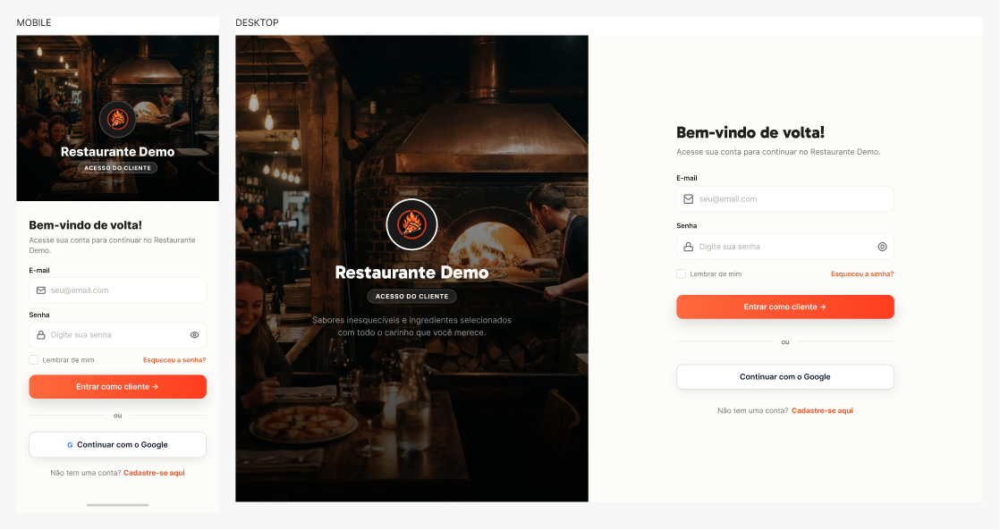

### Detalhes da etapa

| Item | Explicação |
| --- | --- |
| **Objetivo** | Permitir o acesso de clientes e demais perfis já cadastrados. |
| **Identificação** | Entrada de e-mail e senha com hierarquia visual simples e direta. |
| **Recuperação** | O usuário pode iniciar a recuperação de senha sem sair da jornada. |
| **Cadastro** | Quem ainda não possui conta pode seguir diretamente para criação do perfil. |
| **Mobile** | O formulário ocupa a área principal e prioriza leitura, toque e rapidez. |
| **Desktop** | A composição usa o espaço extra para reforçar branding, contexto e organização. |
| **Próximo passo** | Após autenticação válida, o usuário entra na experiência correspondente à sua conta. |

<h2>↓</h2>

## 1.2 — Cadastro

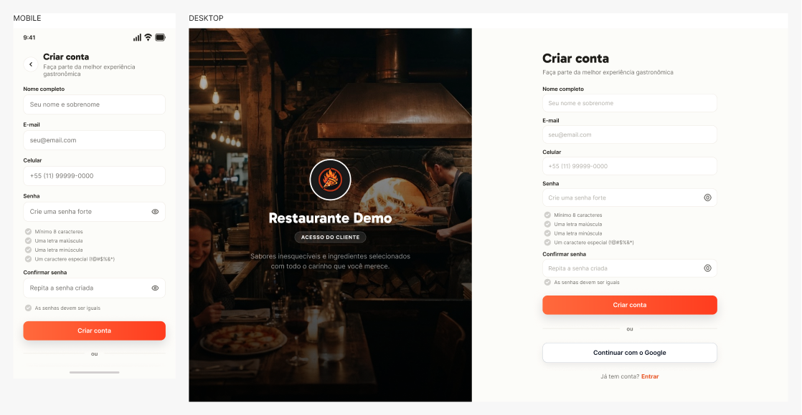

### Detalhes da etapa

| Item | Explicação |
| --- | --- |
| **Objetivo** | Criar a identidade do cliente dentro da plataforma. |
| **Dados pessoais** | Reúne os campos necessários para identificação e relacionamento. |
| **Credenciais** | Define os dados usados nos próximos acessos. |
| **Conta** | Depois do cadastro, pedidos, endereços, cupons e fidelidade podem ser vinculados ao mesmo usuário. |
| **Responsividade** | O conteúdo muda de composição entre telas, mas preserva a mesma ordem funcional. |
| **Próximo passo** | Depois de concluir o cadastro, o usuário pode autenticar e seguir para a Home. |

<h2>↓</h2>

## 1.3 — Recuperar Senha

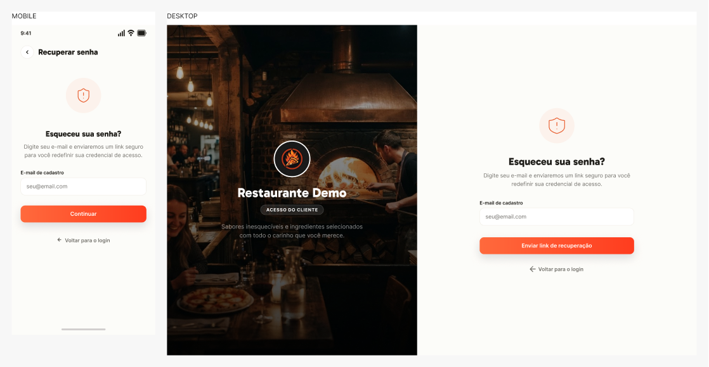

### Detalhes da etapa

| Item | Explicação |
| --- | --- |
| **Objetivo** | Recuperar o acesso à conta sem depender de atendimento manual. |
| **Solicitação** | O usuário informa a conta associada ao acesso. |
| **Orientação** | A tela explica o que acontecerá após a solicitação. |
| **Retorno** | Existe caminho claro para voltar ao login. |
| **Segurança** | As regras de recuperação e invalidação são aplicadas pelo backend. |

---

# 🛒 Etapa 2 — Fluxo de Pedido

**Navegação completa: da Home até o rastreamento da entrega**

### 2.1 — Home → 2.2 — Cardápio → 2.3 — Produto

<h3>↓ continua</h3>

### 2.4 — Carrinho → 2.5 — Endereço → 2.6 — Pagamento

<h3>↓ continua</h3>

### 2.7 — PIX → 2.8 — Confirmado → 2.9 — Rastreamento

## 2.1 — Home

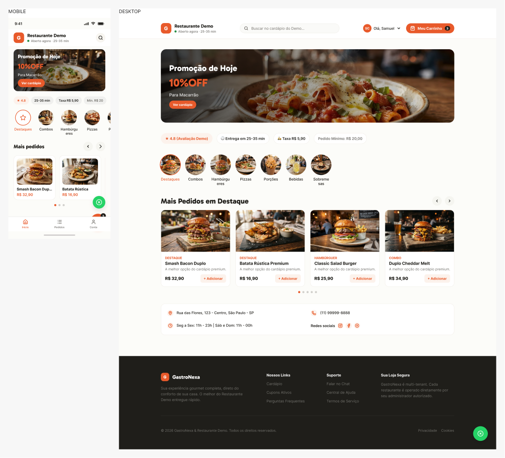

### Detalhes da etapa

| Item | Explicação |
| --- | --- |
| **Identidade do restaurante** | Nome, marca, status de funcionamento e informações principais aparecem no topo. |
| **Banner** | Área de destaque para comunicação visual, campanhas e ofertas. |
| **Categorias** | Atalhos visuais reduzem o tempo para encontrar grupos de produtos. |
| **Mais pedidos** | Produtos populares recebem destaque para acelerar a decisão. |
| **Carrinho** | O acesso permanece visível e acompanha os itens adicionados. |
| **Mobile** | A navegação inferior concentra Início, Pedidos e Conta. |
| **Desktop** | O conteúdo ganha mais área sem mudar a hierarquia do fluxo. |

<h2>→</h2>

## 2.2 — Cardápio

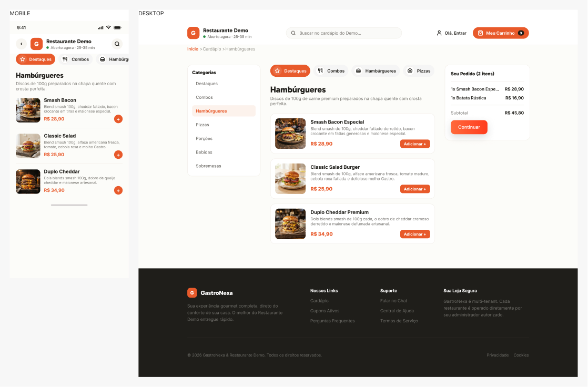

### Detalhes da etapa

| Item | Explicação |
| --- | --- |
| **Categorias** | Filtros visuais organizam destaques, combos, hambúrgueres, pizzas, bebidas e outros grupos. |
| **Produtos** | Cada item apresenta imagem, nome, descrição resumida e preço. |
| **Busca** | O usuário pode localizar um item específico pelo nome. |
| **Disponibilidade** | Produtos podem refletir estado ativo, estoque e configuração do restaurante. |
| **Próximo passo** | A seleção de um item abre a tela de produto e personalização. |

<h2>→</h2>

## 2.3 — Produto

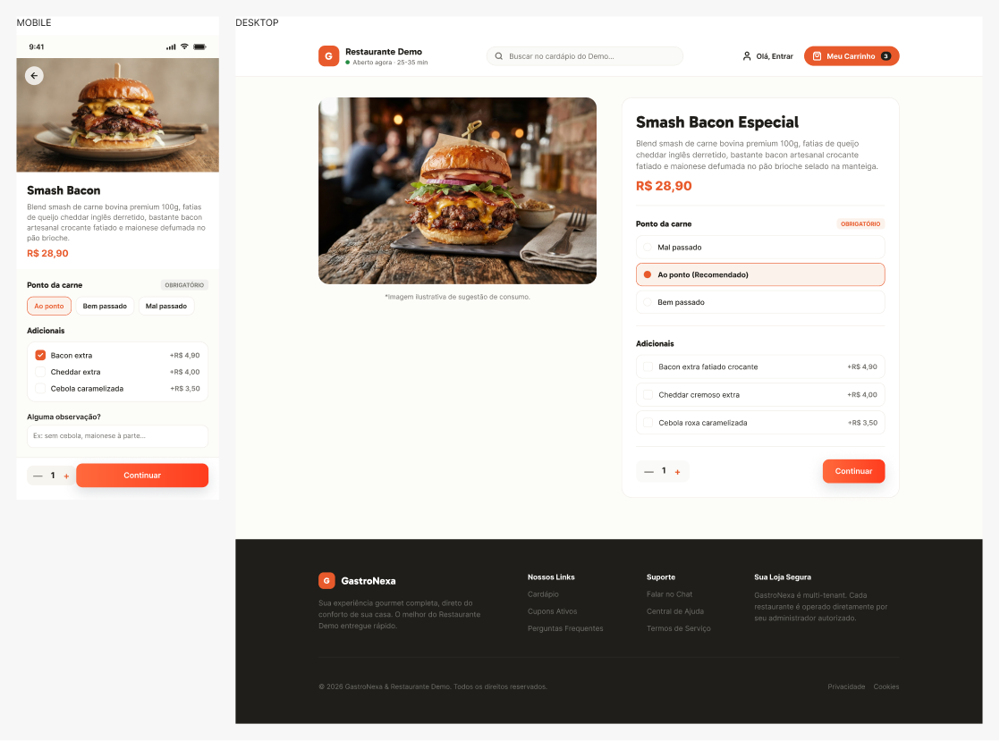

### Detalhes da etapa

| Item | Explicação |
| --- | --- |
| **Apresentação** | Imagem, nome, descrição e preço contextualizam a escolha. |
| **Personalização** | Grupos obrigatórios e opcionais podem receber adicionais e complementos. |
| **Observações** | O cliente consegue enviar instruções específicas para o preparo. |
| **Quantidade** | O total acompanha a quantidade selecionada. |
| **Validação** | As regras de seleção também são conferidas pelo backend. |
| **Próximo passo** | O item configurado é adicionado ao carrinho. |

<h2>↓ continua</h2>

## 2.4 — Carrinho

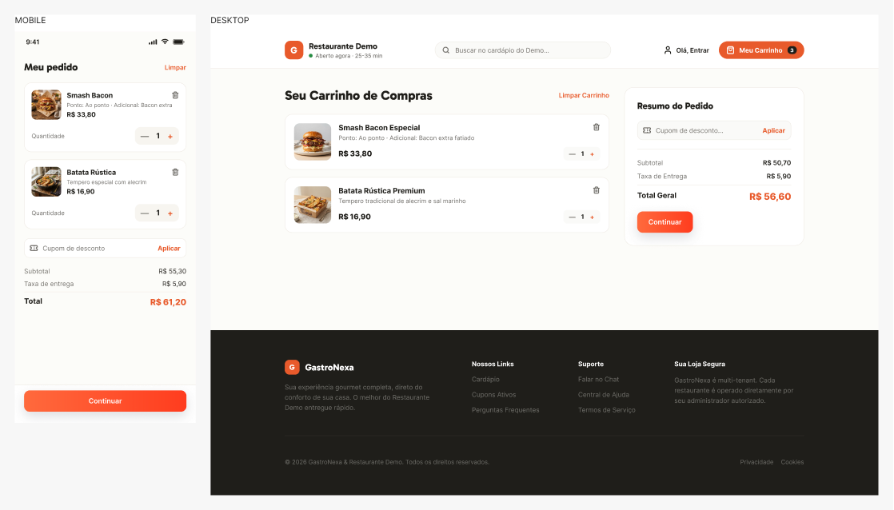

### Detalhes da etapa

| Item | Explicação |
| --- | --- |
| **Resumo** | Exibe os produtos adicionados, quantidades, personalizações e valores. |
| **Revisão** | O usuário pode conferir o pedido antes de iniciar o checkout. |
| **Totais** | Organiza subtotal e demais valores da compra. |
| **Edição** | Permite revisar a composição antes de confirmar a próxima etapa. |
| **Próximo passo** | O fluxo avança para endereço ou modalidade de entrega. |

<h2>→</h2>

## 2.5 — Endereço

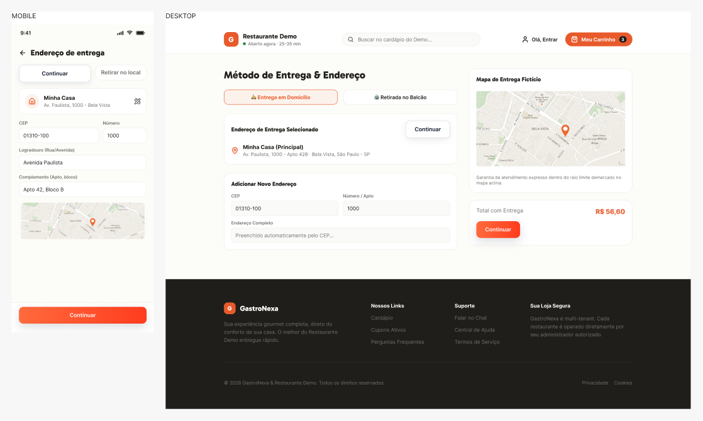

### Detalhes da etapa

| Item | Explicação |
| --- | --- |
| **Destino** | Define o local onde o pedido será entregue. |
| **Complemento** | Informações adicionais ajudam na localização correta. |
| **Endereços salvos** | Usuários autenticados podem reutilizar locais cadastrados. |
| **Cotação** | Distância e regras do restaurante podem afetar taxa e disponibilidade. |
| **Próximo passo** | Com o endereço validado, o usuário segue para pagamento. |

<h2>→</h2>

## 2.6 — Pagamento

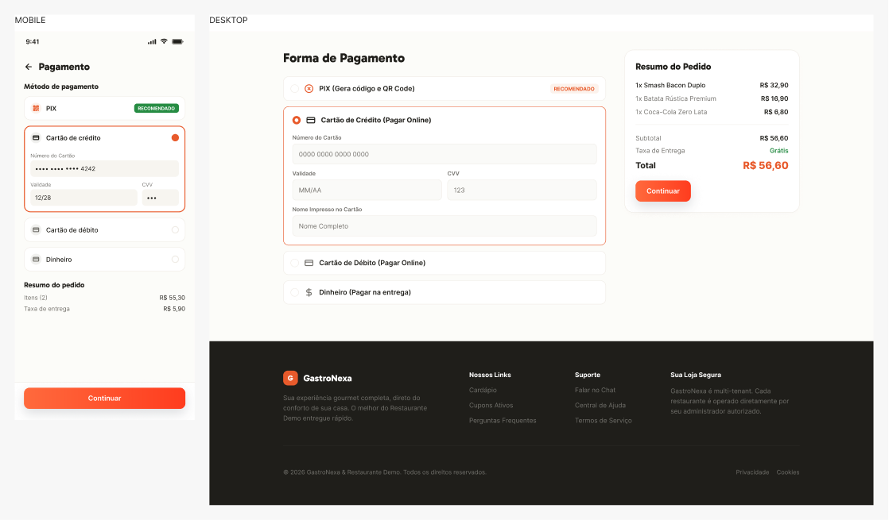

### Detalhes da etapa

| Item | Explicação |
| --- | --- |
| **Métodos** | Mostra os meios de pagamento habilitados para aquele restaurante. |
| **Resumo financeiro** | Mantém o total visível antes da confirmação. |
| **Backend** | A cobrança é criada e validada no servidor. |
| **Segurança** | O valor final não depende apenas dos números enviados pelo navegador. |
| **Próximo passo** | Pagamentos instantâneos, como PIX, seguem para uma tela própria. |

<h2>↓ continua</h2>

## 2.7 — PIX

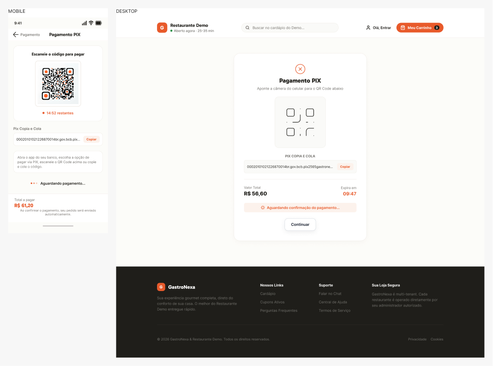

### Detalhes da etapa

| Item | Explicação |
| --- | --- |
| **QR Code** | Permite pagar usando o aplicativo do banco. |
| **Copia e cola** | Oferece alternativa ao escaneamento. |
| **Status** | A interface aguarda confirmação do pagamento. |
| **Reconciliação** | Webhook e consultas ao provedor mantêm o estado financeiro consistente. |
| **Próximo passo** | Pagamento confirmado leva à tela de pedido confirmado. |

<h2>→</h2>

## 2.8 — Confirmado

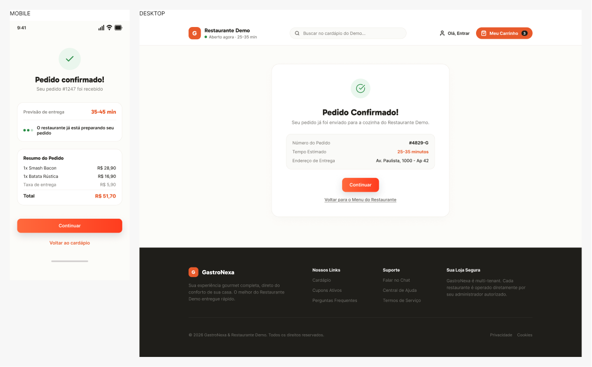

### Detalhes da etapa

| Item | Explicação |
| --- | --- |
| **Confirmação visual** | Deixa claro que o pedido foi criado com sucesso. |
| **Identificação** | Exibe os dados principais para o cliente reconhecer a compra. |
| **Status** | Informa que o restaurante recebeu a solicitação. |
| **Continuidade** | Delivery pode seguir diretamente para a tela de acompanhamento. |

<h2>→</h2>

## 2.9 — Rastreamento

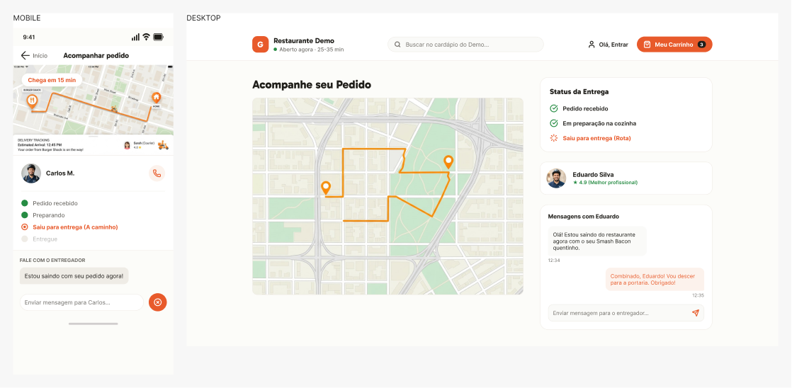

### Detalhes da etapa

| Item | Explicação |
| --- | --- |
| **Mapa** | Mostra a posição da entrega e o destino do cliente. |
| **Progresso** | A timeline indica preparo, pronto, saída para entrega e conclusão. |
| **GPS** | A localização autorizada do entregador pode ser transmitida enquanto a entrega estiver ativa. |
| **Chat em tempo real** | A comunicação acontece dentro da plataforma, sem depender de WhatsApp no fluxo principal. |
| **Persistência** | Eventos realtime atualizam a UI, mas o backend continua sendo a fonte de verdade. |

---

# 🏠 Variações da Home

**Estados alternativos da tela inicial: sem banner, sem categorias e versão mínima**

### Sem Banner → Sem Categorias → Mínima

## Home sem Banner

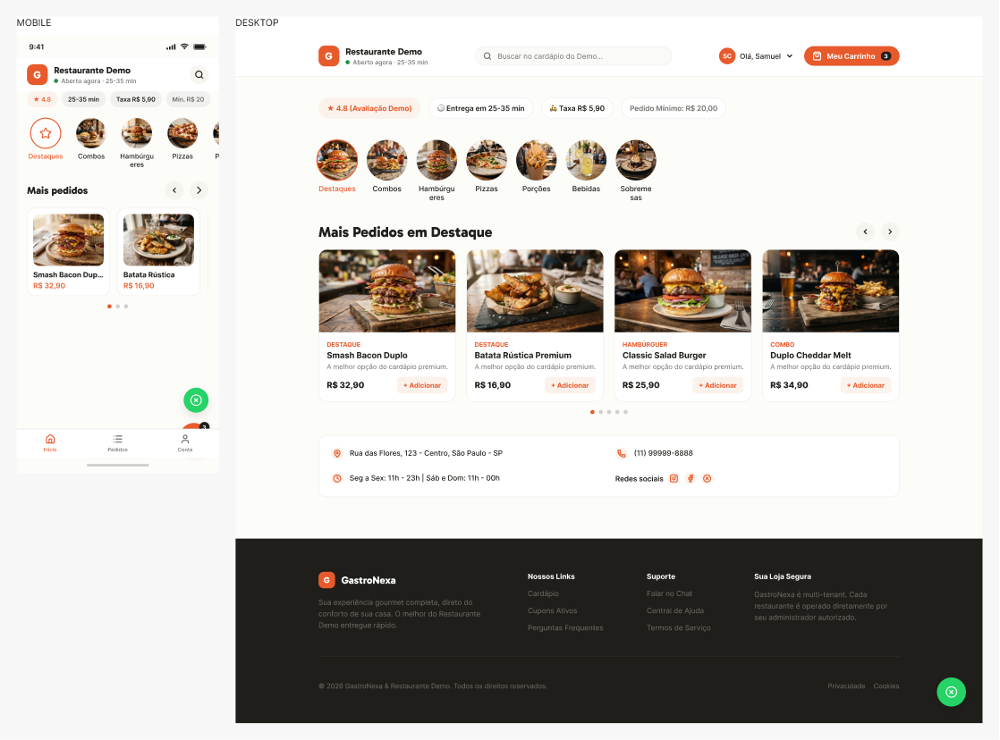

Quando o restaurante não utiliza banner promocional, o bloco é removido sem deixar espaço vazio. As seções seguintes sobem naturalmente e preservam o ritmo visual.

<h2>→</h2>

## Home sem Categorias

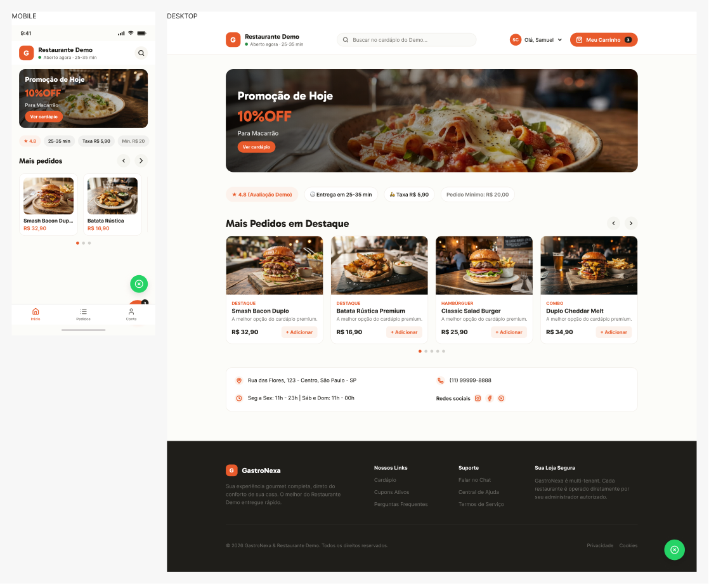

Quando não há categorias suficientes para justificar a navegação horizontal, a página simplifica o caminho e prioriza produtos e destaques.

<h2>→</h2>

## Home Mínima

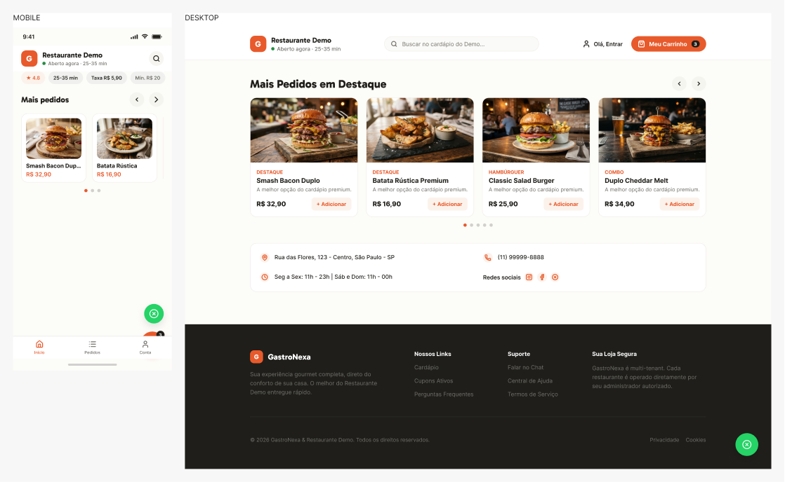

A versão mínima mantém apenas os elementos essenciais para restaurantes com configuração reduzida, evitando componentes vazios e preservando a consistência visual.

---

# 👤 Etapa 3 — Conta & Configurações

**Perfil do usuário, pedidos, endereços, pagamentos, cupons, ajuda, fidelidade e configurações**

### 3.1 — Minha Conta → 3.2 — Meus Pedidos → 3.3 — Endereços Salvos

<h3>↓ continua</h3>

### 3.4 — Métodos de Pagamento → 3.5 — Cupons & Promoções → 3.6 — Ajuda & Suporte

<h3>↓ continua</h3>

### 3.7 — Configurações → 3.8 — Fidelidade → 3.9 — Cupons Resgate

## 3.1 — Minha Conta

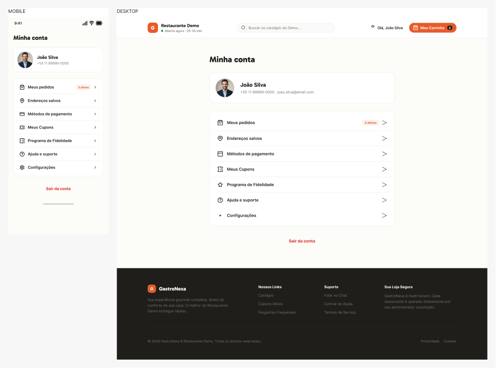

### Detalhes da etapa

A área de conta funciona como o hub pessoal do cliente. Ela conecta histórico de pedidos, endereços, pagamentos, cupons, fidelidade, suporte e preferências em uma única experiência.

<h2>→</h2>

## 3.2 — Meus Pedidos

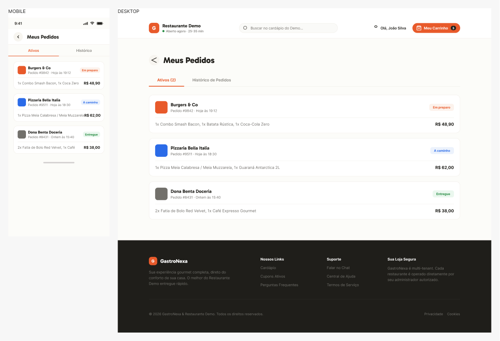

### Detalhes da etapa

Pedidos ativos e histórico são apresentados com contexto suficiente para o cliente reconhecer restaurante, valor, momento da compra e estado atual. Pedidos elegíveis podem abrir detalhes ou rastreamento.

<h2>→</h2>

## 3.3 — Endereços Salvos

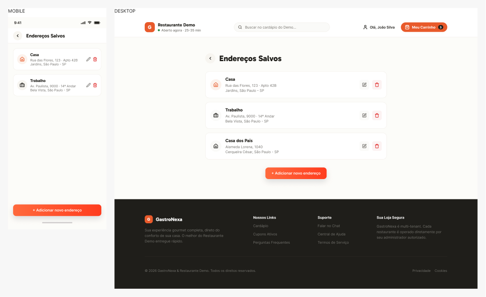

### Detalhes da etapa

Permite cadastrar, editar e reutilizar endereços, reduzindo digitação no checkout e mantendo o destino ligado à conta do usuário.

<h2>↓ continua</h2>

## 3.4 — Métodos de Pagamento

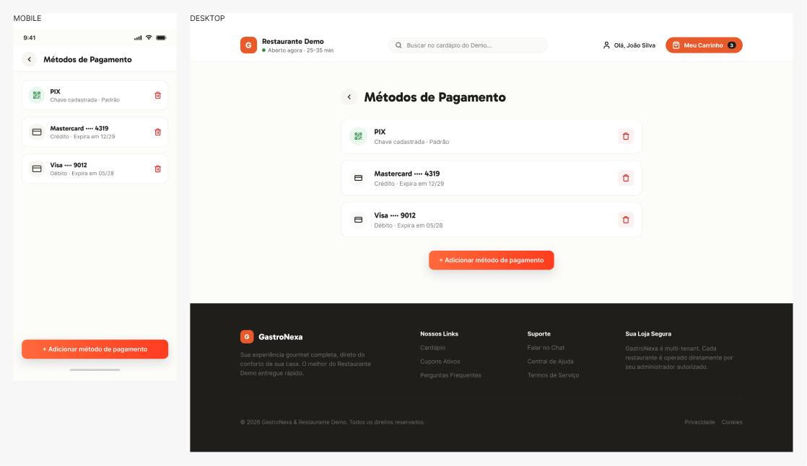

### Detalhes da etapa

Organiza as referências de pagamento disponíveis para a conta. Quando o provedor suporta tokenização, a plataforma trabalha com referências seguras em vez de armazenar dados sensíveis completos.

<h2>→</h2>

## 3.5 — Cupons & Promoções

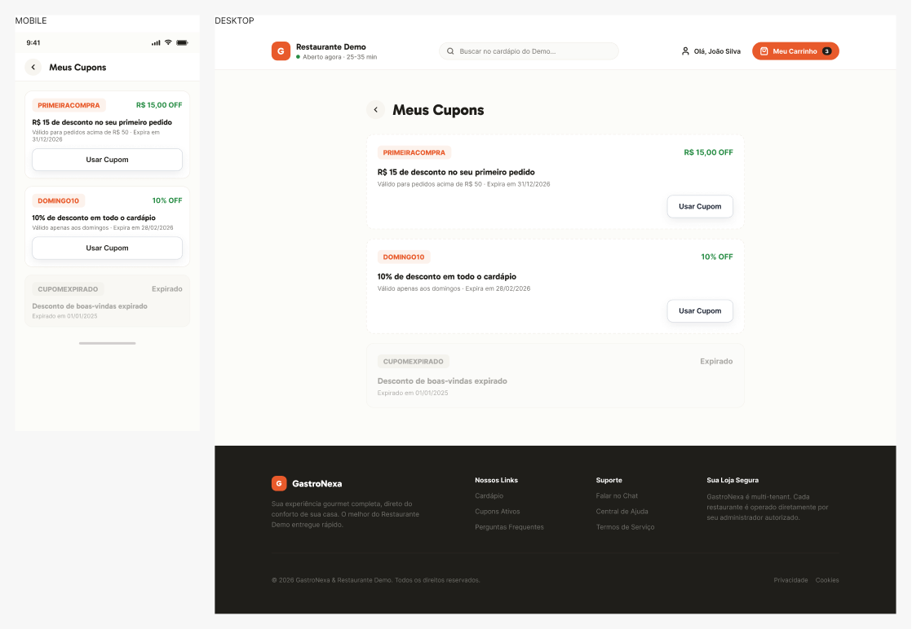

### Detalhes da etapa

Reúne benefícios disponíveis, condições de uso e histórico. A experiência diferencia claramente cupons ativos, utilizados e expirados.

<h2>→</h2>

## 3.6 — Ajuda & Suporte

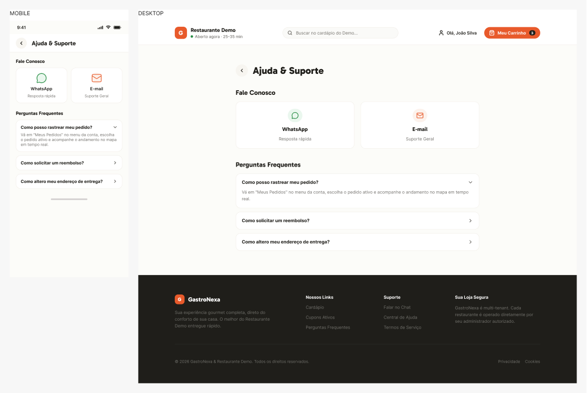

### Detalhes da etapa

Concentra dúvidas frequentes e acesso ao suporte. Fluxos ligados ao pedido podem permanecer dentro da plataforma para preservar contexto e histórico.

<h2>↓ continua</h2>

## 3.7 — Configurações

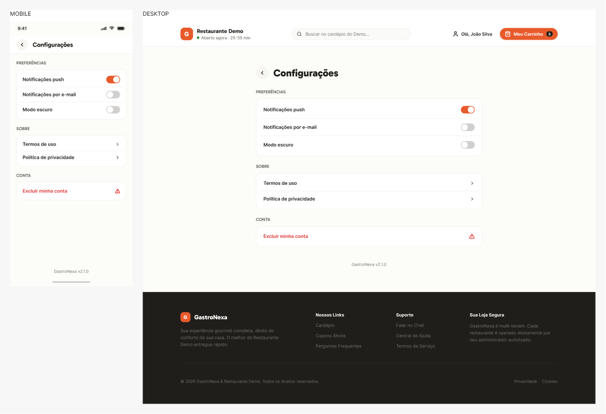

### Detalhes da etapa

Reúne preferências de experiência, privacidade e segurança. Alterações sensíveis continuam sujeitas às validações do backend.

<h2>→</h2>

## 3.8 — Fidelidade

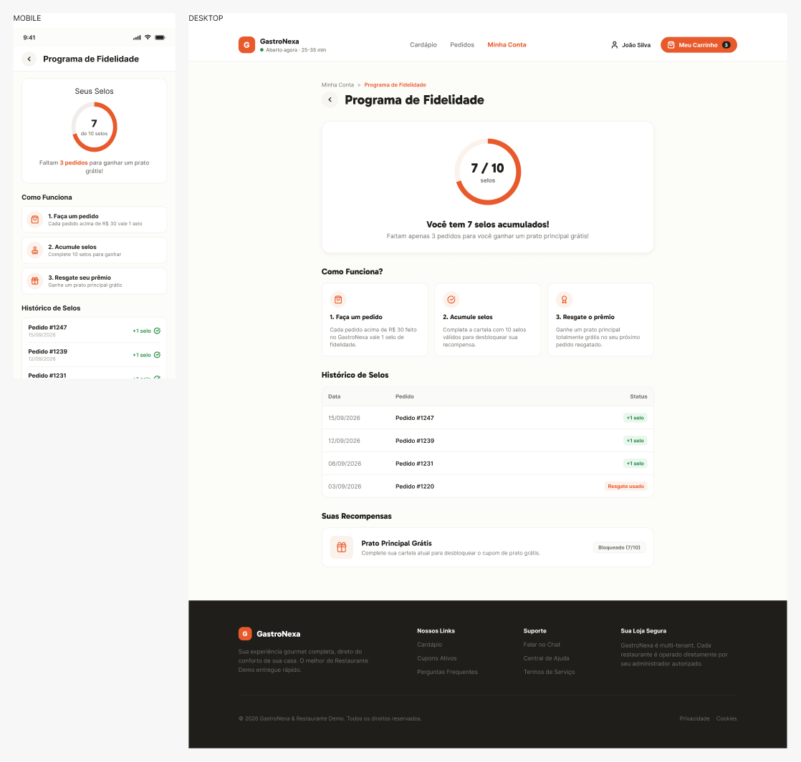

### Detalhes da etapa

Mostra o progresso do cliente em campanhas de recorrência, o benefício esperado e a situação atual até o próximo resgate.

<h2>→</h2>

## 3.9 — Cupons Resgate

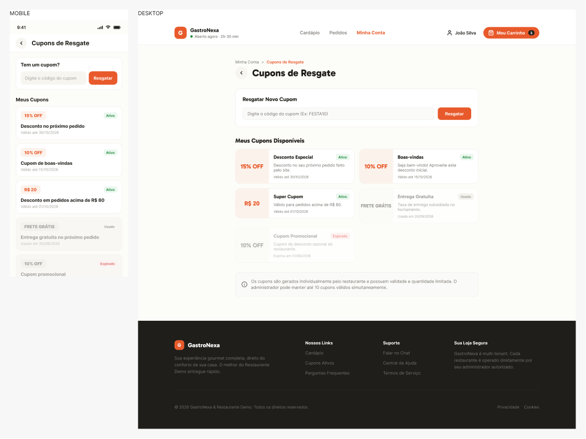

### Detalhes da etapa

Transforma recompensas elegíveis em benefícios utilizáveis e diferencia cupons disponíveis, resgatados e já utilizados.

---

# 🔑 MFA — Verificação em Duas Etapas

**Tela de verificação por código para segurança adicional**

## Verificação MFA

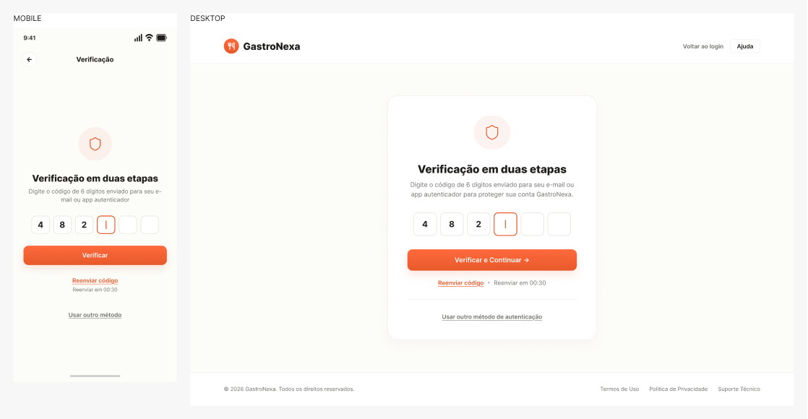

### Detalhes da etapa

| Item | Explicação |
| --- | --- |
| **Uso** | O MFA é opcional por conta. |
| **Código** | Quando habilitado, o login exige uma confirmação adicional. |
| **Validade** | O desafio possui expiração e limite de tentativas. |
| **Preferência** | Contas que não habilitaram MFA continuam usando o fluxo normal. |
| **Alteração** | Ativação e desativação exigem validação da conta. |

---

# 📜 Termos de Serviço & Política de Privacidade

**Páginas legais obrigatórias: termos de uso e política de privacidade (LGPD)**

## Termos de Serviço

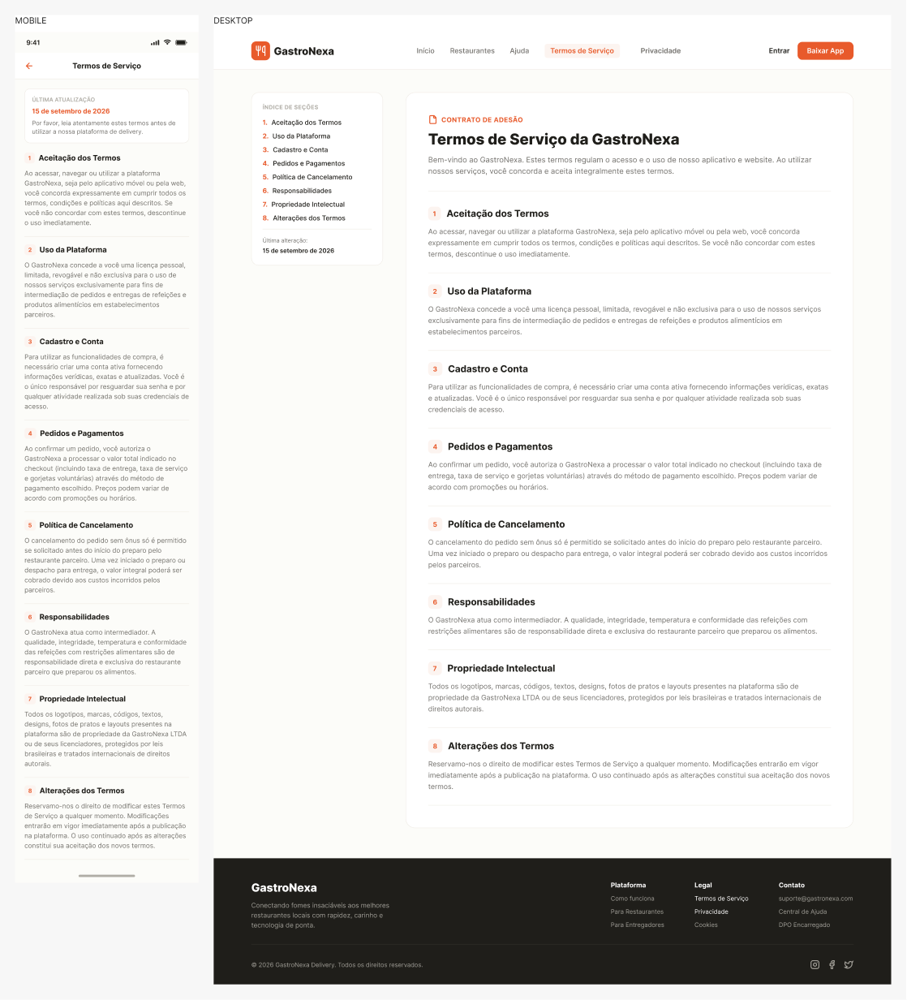

### Detalhes da etapa

A página organiza as regras de uso da plataforma em leitura contínua no mobile e em uma estrutura documental mais ampla no desktop, mantendo a identidade visual do produto.

<h2>→</h2>

## Política de Privacidade

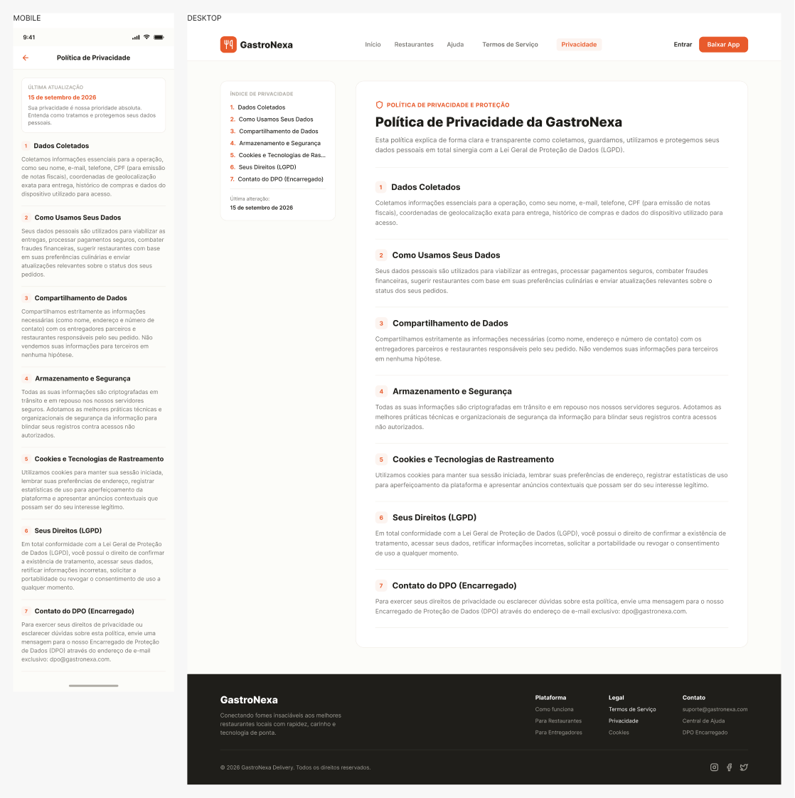

### Detalhes da etapa

Apresenta de forma organizada dados coletados, finalidade de uso, compartilhamento, armazenamento, cookies, direitos previstos na LGPD e contato do encarregado de proteção de dados.

---

# Fluxo operacional do produto

**Cliente → Pedido → Cozinha → Pronto → Entrega → Rastreamento**

| Perfil | Responsabilidade |
| --- | --- |
| **Cliente** | Descoberta, compra, pagamento, conta, fidelidade e acompanhamento. |
| **Administrador** | Cardápio, pedidos, clientes, equipe, operação, integrações e configurações. |
| **Cozinha** | Fila operacional e avanço do preparo. |
| **Garçom** | Mesas, chamados, entrega ao salão e recebimentos presenciais autorizados. |
| **Motoqueiro** | Retirada, rota, localização e conclusão da entrega. |
| **Superadministrador** | Restaurantes, planos, cobrança SaaS e governança da plataforma. |

---

# Arquitetura

| Camada | Tecnologias e responsabilidades |
| --- | --- |
| **Frontend** | React, Vite, TypeScript, React Router, Styled Components, Axios e Lucide. |
| **Backend** | Node.js, Express, TypeScript, Prisma e Socket.IO. |
| **Banco** | PostgreSQL com migrations Prisma. |
| **Tempo real** | Pedidos, cozinha, mesas, suporte, tracking e eventos operacionais. |
| **Mapas** | Leaflet, Geolocation API e providers de roteamento. |
| **Qualidade** | Vitest, Node Test Runner, Playwright, ESLint, Prettier e TypeScript. |
| **Infraestrutura** | Docker Compose, proxy reverso e configuração por ambiente. |

## Multi-tenancy

Cada restaurante possui contexto próprio de dados e configuração. O isolamento é aplicado no backend usando o tenant autorizado para limitar leitura e escrita das operações privadas.

## Tempo real

Socket.IO é usado onde atualização imediata melhora a operação, incluindo mudanças de pedido, cozinha, mesas, chamados, suporte e localização de entrega.

---

# Segurança

O projeto aplica segurança em múltiplas camadas:

- autenticação com access token e refresh controlado;
- autorização por papel, conta, tenant e recurso;
- MFA opcional por conta;
- rate limiting e lockout de autenticação;
- Helmet, CORS e validação de payload;
- idempotência e validação de pagamentos;
- proteção de segredos por variáveis de ambiente;
- auditoria e testes para isolamento multi-tenant.

> Nunca versione arquivos de ambiente, chaves privadas, tokens ou credenciais de gateways.

---

# Qualidade e testes

O monorepo possui validações automatizadas para backend, frontend e agentes operacionais.

**CI completo**

    npm run ci

Esse comando cobre validação arquitetural, Prisma, lint, typecheck, testes, auditoria, build e orçamento de bundle.

**Jornadas críticas E2E**

    npm run test:e2e:critical

---

# Executando localmente

## Pré-requisitos

- Node.js compatível com o projeto;
- npm;
- PostgreSQL;
- Docker/Docker Compose quando necessário.

## Instalação

    npm --prefix backend ci
    npm --prefix backend run db:generate
    npm --prefix frontend ci

## Banco de dados

    npm --prefix backend run db:validate
    npm --prefix backend run db:migrate:dev
    npm --prefix backend run db:seed

## Desenvolvimento

Backend:

    npm --prefix backend run dev

Frontend:

    npm --prefix frontend run dev

| Serviço | Endereço padrão |
| --- | --- |
| Frontend | http://localhost:5173 |
| Backend | http://localhost:3000 |
| Health | http://localhost:3000/health |
| Readiness | http://localhost:3000/ready |
| PostgreSQL | localhost:5432 |

---

# Estrutura do repositório

    .
    ├── backend/
    │   ├── prisma/
    │   ├── scripts/
    │   └── src/modules/
    ├── frontend/
    │   ├── e2e/
    │   └── src/
    │       ├── pages/
    │       ├── Services/
    │       ├── contexts/
    │       └── routes/
    ├── print-agent/
    ├── docs/
    │   └── assets/
    │       └── figma-flow/
    ├── scripts/
    ├── deploy/
    ├── .github/workflows/
    ├── ARCHITECTURE.md
    ├── TESTING.md
    └── DEPLOY.md

---

# Documentação complementar

- [Arquitetura](ARCHITECTURE.md)
- [Estratégia de testes](TESTING.md)
- [Deploy e rollback](DEPLOY.md)
- [Supabase + Prisma](SUPABASE_SETUP.md)
- [Routing / GPS local](ROUTING_GPS_SETUP.md)
- [Routing em produção](ROUTING_PRODUCTION.md)
- [Segurança multi-tenant](docs/SECURITY_MULTI_TENANT_AUDIT.md)
- [Impressão da cozinha](docs/kitchen-printing.md)

---

## Autor

Desenvolvido por **Samuel Gomes**.

**GastroNexa — tecnologia conectando cardápio, operação e entrega.**

